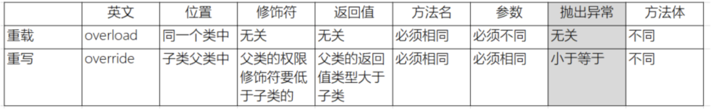
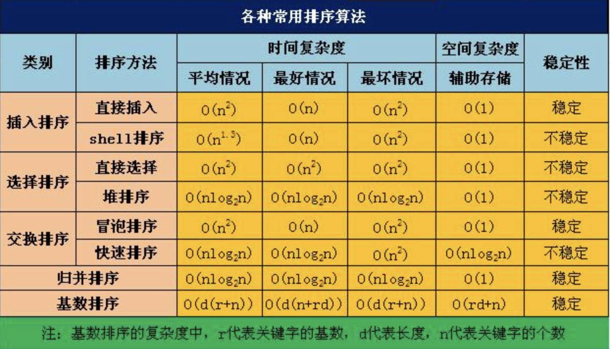
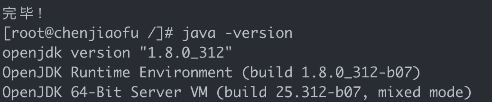
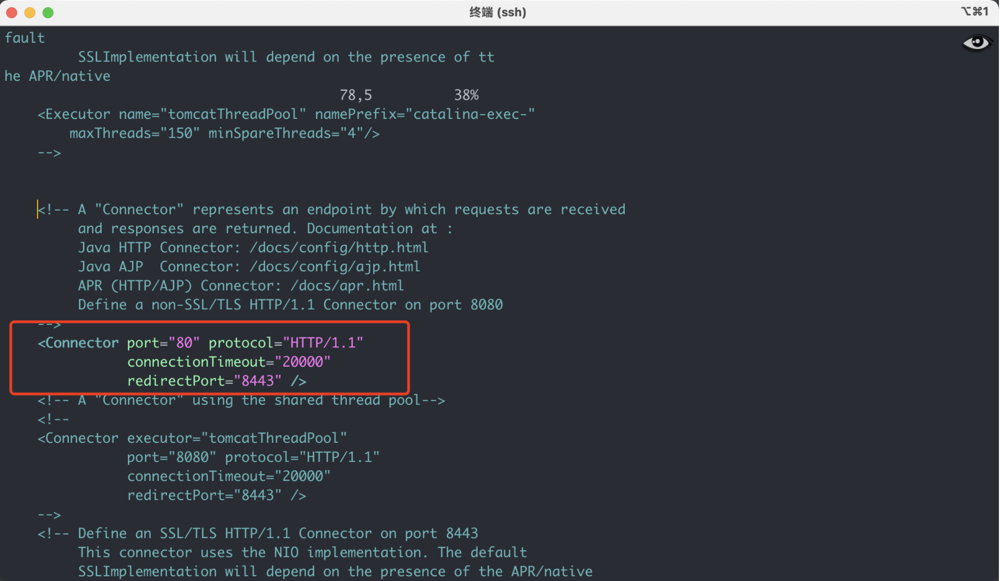
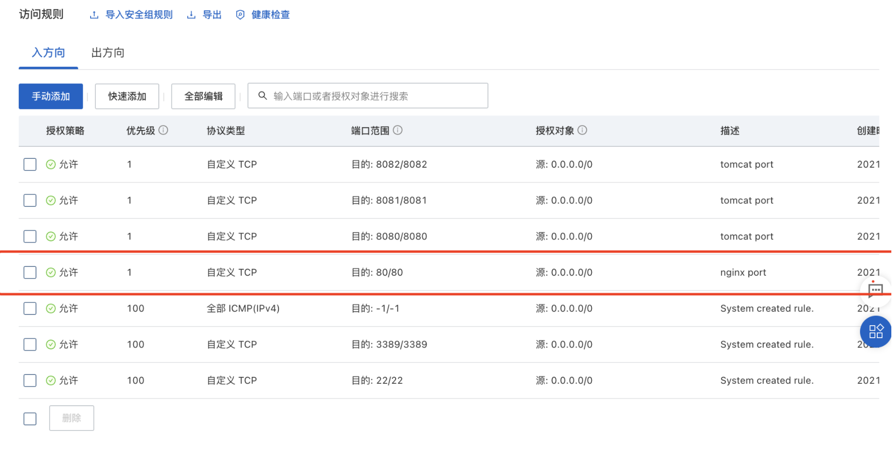
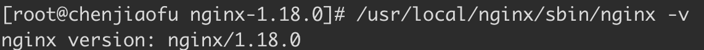
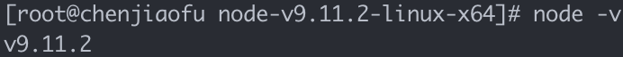
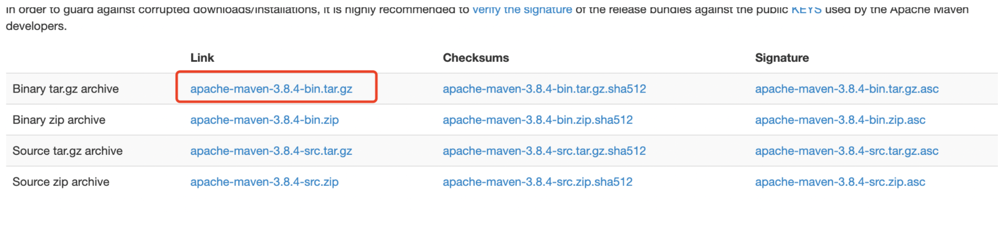
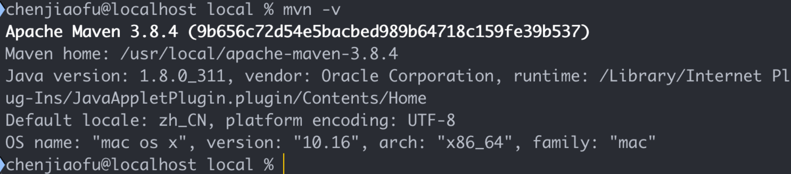
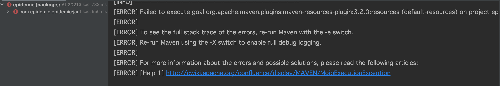

# Java基础

## 1、equals和hashcode

​	hashcode 是通过散列方法进行计算获取唯一的hash值。在hashMap中将通过hash确认对象在桶的位置。即便是通过桶索引（bucketIndex）找到了对象也要调用一个或者多个equals方法去一个一个比较，成功了才属于真正的对象相等。因为一个桶里面只能装一个entry对象，但是entry对象是可以包含一个索引值去指向另一个entry，最终可以形成entry链；

​	equal是源于Object类，默认方法是去对比两个对象的引用，可以通过重写equal方法去自定义验证对象是否相等的新规则。

[hashcode详解]: https://www.cnblogs.com/whgk/p/6071617.html


## 2、StringBuffer、StringBuilder和String的区别

1）StringBuffer和StringBuilder初始化对象的时候是创建一个默认长度为16的char数组，修改都是针对char[]进行操作；String的底层是创建一个final 的char数组，他的操作是将引用对象指向新的对象。

2）StringBuffer是线程安全的，StringBuilder是线程不安全的。


## 3、Java的重写和重载有什么区别

1）重写是子类继承父类的方法进行重写，重载是同一个类下相同方法名，可以根据传参类型、传参个数的不同进行方法重载。

2）子类重写的方法名、返回类型、传参必须和父类完全相同，修饰符、异常范围必须小于等于父类；重载只要求方法名相同，传参数量和类型必须不同；



## 4、谈一谈HashMap的扩容机制

初始化HashMap时如果不传容量大小，默认16，加载因子为0.75；当容器容量乘上加载因子小于当前哈希条目时，进行扩容操作，每次扩容都是以2的指数倍进行扩容；

Java1.7在扩容时需要对每个元素进行rehash计算扩容后的hash地址，而1.8之后通过hash值和oldCap(旧容器大小)进行&位计算，得出新的hash地址；因为数组是以2的指数倍扩容，就相当于二进制中在多一个高位，如果高位是1，则将其调整到原索引加上oldCap的位置上，如果是0则无需调整。


## 5、为什么HashMap扩容的时候是二的指数倍

1）因为在二进制中2的指数减去1，这个结果n的二进制全部为1，再拿n去与hash值进行&位运算可以充分的散列，避免必要的hash冲突。

2）由于扩容后最高位是否为1可以判断元素是否移位，优化性能。


# Spring框架

## 1、谈谈对Spring 的理解

1）Spring是一个开源框架

2）Spring是开源的，拥有庞大的且活跃的社区

3）Spring有两大核心：AOP(面向切面编程)和IOC(控制反转)

4）Spring的ORM和DAO提供了与第三方持久层框架的的良好整合，并简化了底层的数据库访问


## 2、让我们谈一谈AOP的理解

AOP的意思是面向切面编程，任何一个系统都是由不同的组件组成的，每个组件负责一块特定的功能，当然会存在很多组件是跟业务无关的，例如日志、事务、权限等核心服务组件，这些核心服务组件经常融入到具体的业务逻辑中，如果我们为每一个具体业务逻辑操作都添加这样的代码，很明显代码冗余太多，因此我们需要将这些公共的代码逻辑抽象出来变成一个切面，然后注入到目标对象（具体业务）中去，AOP正是基于这样的一个思路实现的，通过动态代理的方式，将需要注入切面的对象进行代理，在进行调用的时候，将公共的逻辑直接添加进去，而不需要修改原有业务的逻辑代码，只需要在原来的业务逻辑基础之上做一些增强功能即可。

### proxy 

​	proxy是java内置的动态代理，其特点是无需第三方依赖；

​	proxy代理的底层逻辑是通过反射的原理，它是可以对多个不同的接口实现类中定义的方法进行代理；

### cglib

​	cglib的特点是需要导入第三方依赖；

​	cglib代理的底层逻辑是通过子类继承父类去重写方法的方式进行动态代理；


## 3、让我们谈一谈对IOC的理解

​	IOC（invest of controll） ，意思是控制反转，它是一种设计思想，并不是一种技术框架或者结构。在传统的创建对象中，是通过对象内部的new方法去实例一个对象，而IOC则是通过特定的容器去扫描注解，自动去创建依赖对象。

​	正转的意思是通过对象主动控制去直接获取依赖对象，而反转则是通过容器来帮忙创建和注入依赖对象。

​	IOC容器降低了业务对象替换的复杂性，降低了对象间的耦合；

## 4、BeanFactory和ApplicationContext有什么区别

相同:

- 它们两个都是spring下的IOC容器，都是Interface接口，ApplicationContext继承于BeanFactory（ApplicationContext集成于ListableBeanFactory，ListableBeanFactory继承于BeanFactory）
- 它们都可以用来配置XML属性，也支持属性的自动注入。

不同：

- BeanFactory在调用getBean()的时候才实例化Bean（懒加载），而ApplicationContext是在启动容器的时候实例化Bean（非懒加载）。
- 因为ApplicationContext是BeanFactory的扩展，提供了更多的功能:支持国际化、事件传递、Bean自动装配、各种不同应用层的Context实现。

## 5、Spring扫描底层的原理

1. 首先，通过ResourcePatternResolver获得指定包路径下的所有 .class 文件（Spring源码中将此文件包装成了Resource对象)
2. 遍历每个Resource对象
3.  利用MetadataReaderFactory解析Resource对象得到MetadataReader（在Spring源码中MetadataReaderFactory具体的实现类为CachingMetadataReaderFactory，MetadataReader的具体实现类为SimpleMetadataReader）
4. 利用MetadataReader进行excludeFilters和includeFilters，以及条件注解@Conditional的筛选（条件注解并不能理解:某个类上是否存在@Conditional注解，如果存在则调用注解中所指定的类的match方法进行匹配，匹配成功则通过筛选，匹配失败则pass掉）
5. 筛选通过后，基于metadataReader生成ScannedGenericBeanDefinition
6. 再基于metadataReader判断是不是对应的类是不是接口或抽象类
7. 如果筛选通过，那么就表示扫描到了一个Bean，将ScannedGenericBeanDefinition加入结果集

## 6、Spring启动流程原理


## 7、简述spring bean的生命周期？

1）实例化（CreateBeanInstance）

​	在Java堆内存开辟空间，属性存放默认值

2）设置属性

1. 用户自定义属性赋值（populateBean）
2. 容器对象赋值（invokeAwareMethods）

3）初始化 （Initialization）

1. 调用BeanPostProccessor的前置接口-postProcessBeforeInitialization()
2. 判断当前bean对象是否设置了InitializingBean接口，然后进行属性的设置等基本工作
3. 如果当前bean对象定义了初始化方法，那么在此处调用初始化方法
4. 调用BeanPostProccessor的后置接口-postProcessAfterInitialization()

4）调用对象

5）销毁（Destruction）

1. DisposableBean的destory()方法
2. 自定义的destory-method指定方法


> 参考请别再问Spring Bean的生命周期了！
>
> https://www.jianshu.com/p/1dec08d290c1


## 8、BeanFactory和FactoryBean有什么区别？


# Mybatis

# JVM

## 1、结构概览

class文件 -> 类加载器 -> 运行时数据区（Java栈、本地方法栈、方法区、堆、程序计数器）-> 执行引擎（windows、linux、mac）->本地方法接口（native方法）<- 本地方法库


# 数据库

## mysql


# 中间件

## Redis

## RocketMQ

# 算法

## 八大排序算法



### 1、冒泡排序

### 2、快速排序

### 3、归并排序

### 4、希尔排序

### 5、直接插入排序

### 6、基数排序

### 7、堆排序

### 8、简单选择排序

# 软件环境

## Linux下安装Java环境

1.执行以下命令，查看yum源中JDK版本。

```shell
yum list java*
```

2.执行以下命令，使用yum安装JDK1.8。

```shell
yum -y install java-1.8.0-openjdk*
```

3.执行以下命令，查看是否安装成功。

```shell
java -version
```

如果显示如下图内容，则表示JDK安装成功。




------

## Linux下安装Mysql

1.如果Centos7以上的系统，由于系统自带mysql会导致版本冲突，请先禁用mysql

```shell
yum module disable mysql
```

2.执行以下命令，下载并安装MySQL官方的Yum Repository。

```shell
wget http://dev.mysql.com/get/mysql57-community-release-el7-10.noarch.rpm
yum -y install mysql57-community-release-el7-10.noarch.rpm
yum -y install mysql-community-server
```

3.执行以下命令，启动 MySQL 数据库。

```shell
systemctl start mysqld.service
```

4.执行以下命令，查看MySQL初始密码。

```shell
grep "password" /var/log/mysqld.log
```

5.执行以下命令，登录数据库。

```shell
mysql -uroot -p
```

6. 执行以下命令，修改MySQL默认密码。

```shell
set global validate_password_policy=0;  #修改密码安全策略为低（只校验密码长度，至少8位）。
ALTER USER 'root'@'localhost' IDENTIFIED BY '12345678';
```

7.执行以下命令，授予root用户远程管理权限。

```shell
GRANT ALL PRIVILEGES ON *.* TO 'root'@'%' IDENTIFIED BY '12345678';
```

8. 输入exit退出数据库。

------

## Linux下安装Tomcat

1.执行以下命令，下载Tomcat压缩包。

说明:该资源包可能会失效，请自行去清华镜像官网下载。

```shell
wget https://mirrors.tuna.tsinghua.edu.cn/apache/tomcat/tomcat-8/v8.5.73/bin/apache-tomcat-8.5.73.tar.gz
```

2.执行以下命令，解压刚刚下载Tomcat包。

```shell
tar -zxvf apache-tomcat-8.5.73.tar.gz
```

3.执行以下命令，修改Tomcat名字。

```shell
mv apache-tomcat-8.5.73 /usr/local/Tomcat8.5
```

4.执行以下命令，为Tomcat授权。

```shell
chmod +x /usr/local/Tomcat8.5/bin/*.sh
```

5.执行以下命令，修改Tomcat默认端口号为80。

说明： Tomcat默认端口号为8080。

```shell
sed -i 's/Connector port="8080"/Connector port="80"/' /usr/local/Tomcat8.5/conf/server.xml
```



6. 启动Tomcat。

```shell
/usr/local/Tomcat8.5/bin/./startup.sh
```

7.访问Tomcat。

直接访问你的公网IP即可，如果你是阿里云ECS需添加安全组策略。



## Linux下安装Nginx

1、从nginx官网下载解压包

```shell
wget http://nginx.org/download/nginx-1.18.0.tar.gz
```

2、安装Nginx依赖

```shell
yum -y install gcc zlib zlib-devel pcre-devel openssl openssl-devel
```

3、移动安装包

```shell
mv nginx-1.18.0.tar.gz /usr/local/
```

4、解压压缩包

```shell
tar -zxvf nginx-1.18.0.tar.gz
```

5、进入安装包目录并编译安装

```shell
cd nginx-1.18.0.tar.gz/  ## 进入安装包
./configure							 ## 编译
make && make install     ## 安装
```

shell6、验证是否成功




## Linux下安装Vue运行环境

1、下载node.js解压包

```shell
wget https://nodejs.org/download/release/v9.11.2/node-v9.11.2-linux-x64.tar.xz
```

2、解压

```shell
tar -xf node-v9.11.2-linux-x64.tar.xz
```

3、配置全局变量

```shell
ln -s /usr/local/nodejs/node-v9.11.2-linux-x64/bin/npm /usr/local/bin/ 	##建立软连接，变为全局
rm -f /usr/local/bin/node
ln -s /usr/local/nodejs/node-v9.11.2-linux-x64/bin/node /usr/local/bin/ ##建立软连接，变为全局
node -v ##检验nodejs是否已变为全局
```




4、安装cnpm

```shell
npm install -g cnpm --registry=https://registry.npm.taobao.org

##建立软连接
rm -f  /usr/local/bin/cnpm
ln -s /usr/local/nodejs/node-v9.11.2-linux-x64/bin/cnpm  /usr/local/bin/cnpm
```


## Mac下安装Maven

1、下载资源包

下载地址：https://maven.apache.org/download.cgi



2、将下载的压缩包解压到/usr/local文件夹下

​	通过指令

```shell
cd /usr/local
sudo mv /Users/chenjiaofu/Downloads/apache-maven-3.8.4-bin.tar.gz ./
tar zxvf apache-maven-3.8.4-bin.tar.gz
```

​	通过finder访问/usr/local，进行移动文件并解压；（**访问文件夹快捷键 command+shift+G**）

3、修改配置文件

打开终端，输入vim ~/.bash_profile 按i进入编辑模式

或者直接 open ~/.bash_profile 打开配置文件


将下面两句拷贝到文件内

```tex
export MAVEN_HOME=/usr/local/apache-maven-3.8.4
export PATH=$MAVEN_HOME/bin:$PATH
```

添加之后 执行 source ~/.bash_profile 为配置环境变量生效

生效后 测试 mvn -v 查看是否出现maven版本




4、配置国内镜像

编辑`MAVEN_HOME/conf/setting.xml`文件找到`<mirrors>`节点，往里面添加配置代码

```xml
<mirror>
        <id>alimaven</id>
        <name>aliyun maven</name>
        <url>http://maven.aliyun.com/nexus/content/groups/public/</url>
        <mirrorOf>central</mirrorOf>
    </mirror>
    <mirror>
        <id>central</id>
        <name>Maven Repository Switchboard</name>
        <url>http://repo1.maven.org/maven2/</url>
        <mirrorOf>central</mirrorOf>
    </mirror>
    <mirror>
        <id>repo2</id>
        <mirrorOf>central</mirrorOf>
        <name>Human Readable Name for this Mirror.</name>
        <url>http://repo2.maven.org/maven2/</url>
    </mirror>
    <mirror>
        <id>ibiblio</id>
        <mirrorOf>central</mirrorOf>
        <name>Human Readable Name for this Mirror.</name>
        <url>http://mirrors.ibiblio.org/pub/mirrors/maven2/</url>
    </mirror>
    <mirror>
        <id>jboss-public-repository-group</id>
        <mirrorOf>central</mirrorOf>
        <name>JBoss Public Repository Group</name>
        <url>http://repository.jboss.org/nexus/content/groups/public</url>
    </mirror>
    <!-- 中央仓库在中国的镜像 -->
    <mirror>
        <id>maven.net.cn</id>
        <name>oneof the central mirrors in china</name>
        <url>http://maven.net.cn/content/groups/public/</url>
        <mirrorOf>central</mirrorOf>
    </mirror>
```

5、配置本地仓库

```xml
<localRepository>/Users/chenjiaofu/Documents/apache-maven-3.8.4/maven-repo</localRepository>
```


# Github

## MAC系统下绑定github,ssh key

 参考文章 https://www.jianshu.com/p/f008d9fe3f34/


## GitHub常用指令

```
git config --global --edit //全局打开配置文件

git pull orgin main //更新
git clone xxx  //从服务器上将代码给拉下来
git commit -am "提交的注释" //提交代码
git add [file1] [file2] [directory1] //添加文件或文件夹（包括文件夹下所有文件）
git rm [file1] [directory1] //删除文件或文件夹
git push orgin main//将本地文件推送到云端，20年底分支从默认的master改为main，所以这里是main
git branch -m br_rename_old br_rename_new //将本地仓库的br_rename_old的名称修改为br_rename_new

```


# 平时遇到的BUG

## Springboot项目打包失败



解决方法：

​	在pom文件下的plugins下添加代码块

```xml
<plugin>
    <groupId>org.apache.maven.plugins</groupId>
    <artifactId>maven-resources-plugin</artifactId>
    <version>2.4.3</version>
</plugin>
```

# Mac系统下DNS污染

```shell
sudo killall -HUP mDNSResponder ##清除DNS缓存
```


# 常用指令

```shell
nohup java -jar epidemic-0.0.1-SNAPSHOT.jar >	 /dev/null 2>&1 &  ##Jar包后台启动指令

```
