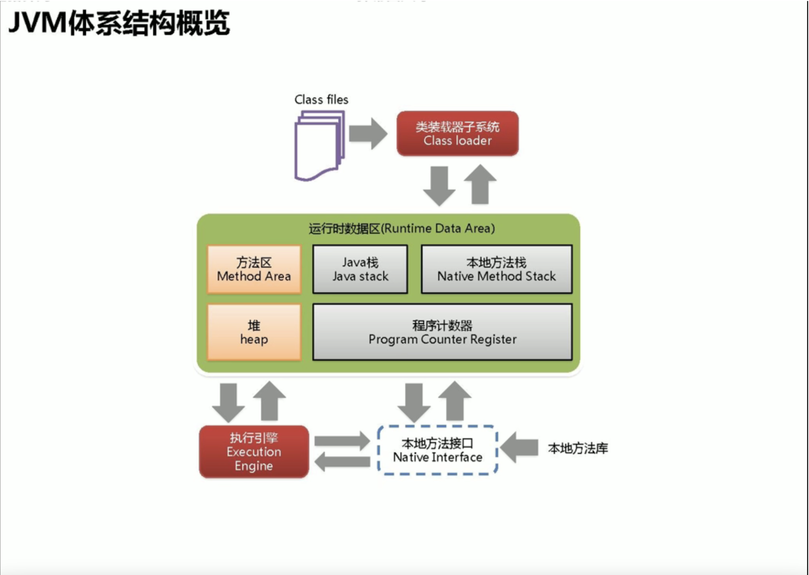

# Java基础

## 1、equals和hashcode

​	hashcode 是通过散列方法进行计算，并将算出的整数作为内存地址进行存储。即便是通过桶索引（bucketIndex）找到了对象也要调用一个或者多个equals方法去一个一个比较，成功了才属于真正的对象相等。因为一个桶里面只能装一个entry对象，但是entry对象是可以包含一个索引值去指向另一个entry，最终可以形成entry链；

​	equal是源于Object类，默认方法是去对比两个对象的引用，可以通过重写equal方法去自定义验证对象是否相等的新规则。

[通过java HashMap的存取方式来学习Hash存储机制 ]: http://www.zuidaima.com/share/1850411710188544.htm


# Spring框架

## 1、让我们谈一谈AOP的理解

AOP的意思是面向切面编程，传统的编程思想是

### proxy 

​	proxy是java内置的动态代理，其特点是无需第三方依赖；

​	proxy代理的底层逻辑是通过反射的原理，它是可以对多个不同的接口实现类中定义的方法进行代理；

### cglib

​	cglib的特点是需要导入第三方依赖；

​	cglib代理的底层逻辑是通过子类继承父类去重写方法的方式进行动态代理；

## 2、让我们谈一谈对IOC的理解

​	IOC（invest of controll） ，意思是控制反转，它是一种设计思想，并不是一种技术框架或者结构。在传统的创建对象中，是通过对象内部的new方法去实例一个对象，而IOC则是通过特定的容器去扫描注解，自动去创建依赖对象。

​	正转的意思是通过对象主动控制去直接获取依赖对象，而反转则是通过容器来帮忙创建和注入依赖对象。


# JVM

## 1、结构概览

class文件 -> 类加载器 -> 运行时数据区（Java栈、本地方法栈、方法区、堆、程序计数器）-> 执行引擎（windows、linux、mac）->本地方法接口（native方法）<- 本地方法库




# 数据库

## mysql


# 中间件

## Redis

## RocketMQ

# 算法

## 八大排序算法


### 1、冒泡排序

### 2、快速排序

### 3、归并排序

### 4、希尔排序

### 5、直接插入排序

### 6、基数排序

### 7、堆排序

### 8、简单选择排序

# 软件环境

## Linux下安装Java环境

1.执行以下命令，查看yum源中JDK版本。

```
yum list java*
```

2.执行以下命令，使用yum安装JDK1.8。

```
yum -y install java-1.8.0-openjdk*
```

3.执行以下命令，查看是否安装成功。

```
java -version
```

如果显示如下图内容，则表示JDK安装成功。


------

## Linux下安装Mysql

1.如果是阿里云的ECS，由于阿里云ECS自带mysql会导致版本冲突，请先禁用mysql

```
yum module disable mysql
```

2.执行以下命令，下载并安装MySQL官方的Yum Repository。

```
wget http://dev.mysql.com/get/mysql57-community-release-el7-10.noarch.rpm
yum -y install mysql57-community-release-el7-10.noarch.rpm
yum -y install mysql-community-server
```

3.执行以下命令，启动 MySQL 数据库。

```
systemctl start mysqld.service
```

4.执行以下命令，查看MySQL初始密码。

```
grep "password" /var/log/mysqld.log
```

5.执行以下命令，登录数据库。

```
mysql -uroot -p
```

6. 执行以下命令，修改MySQL默认密码。

```
set global validate_password_policy=0;  #修改密码安全策略为低（只校验密码长度，至少8位）。
ALTER USER 'root'@'localhost' IDENTIFIED BY '12345678';
```

7.执行以下命令，授予root用户远程管理权限。

```
GRANT ALL PRIVILEGES ON *.* TO 'root'@'%' IDENTIFIED BY '12345678';
```

8. 输入exit退出数据库。

------

## Linux下安装Tomcat

1.执行以下命令，下载Tomcat压缩包。

说明:该资源包可能会失效，请自行去清华镜像官网下载。

```
wget https://mirrors.tuna.tsinghua.edu.cn/apache/tomcat/tomcat-8/v8.5.73/bin/apache-tomcat-8.5.73.tar.gz
```

2.执行以下命令，解压刚刚下载Tomcat包。

```
tar -zxvf apache-tomcat-8.5.73.tar.gz
```

3.执行以下命令，修改Tomcat名字。

```
mv apache-tomcat-8.5.73 /usr/local/Tomcat8.5
```

4.执行以下命令，为Tomcat授权。

```
chmod +x /usr/local/Tomcat8.5/bin/*.sh
```

5.执行以下命令，修改Tomcat默认端口号为80。

说明： Tomcat默认端口号为8080。

```
sed -i 's/Connector port="8080"/Connector port="80"/' /usr/local/Tomcat8.5/conf/server.xml
```


6. 启动Tomcat。

```
/usr/local/Tomcat8.5/bin/./startup.sh
```

7.访问Tomcat。

直接访问你的公网IP即可，如果你是阿里云ECS需添加安全组策略。


## Mac下安装Maven

1、下载资源包

下载地址：https://maven.apache.org/download.cgi


2、将下载的压缩包解压到/usr/local文件夹下

​	通过指令

```
cd /usr/local
sudo mv /Users/chenjiaofu/Downloads/apache-maven-3.8.4-bin.tar.gz ./
tar zxvf apache-maven-3.8.4-bin.tar.gz
```

​	通过finder访问/usr/local，进行移动文件并解压；（**访问文件夹快捷键 command+shift+G**）

3、修改配置文件

打开终端，输入vim ~/.bash_profile 按i进入编辑模式

或者直接 open ~/.bash_profile 打开配置文件


将下面两句拷贝到文件内

```
export MAVEN_HOME=/usr/local/apache-maven-3.8.4
export PATH=$MAVEN_HOME/bin:$PATH
```

添加之后 执行 source ~/.bash_profile 为配置环境变量生效

生效后 测试 mvn -v 查看是否出现maven版本


4、配置国内镜像

编辑`MAVEN_HOME/conf/setting.xml`文件找到`<mirrors>`节点，往里面添加配置代码

```
<mirror>
        <id>alimaven</id>
        <name>aliyun maven</name>
        <url>http://maven.aliyun.com/nexus/content/groups/public/</url>
        <mirrorOf>central</mirrorOf>
    </mirror>
    <mirror>
        <id>central</id>
        <name>Maven Repository Switchboard</name>
        <url>http://repo1.maven.org/maven2/</url>
        <mirrorOf>central</mirrorOf>
    </mirror>
    <mirror>
        <id>repo2</id>
        <mirrorOf>central</mirrorOf>
        <name>Human Readable Name for this Mirror.</name>
        <url>http://repo2.maven.org/maven2/</url>
    </mirror>
    <mirror>
        <id>ibiblio</id>
        <mirrorOf>central</mirrorOf>
        <name>Human Readable Name for this Mirror.</name>
        <url>http://mirrors.ibiblio.org/pub/mirrors/maven2/</url>
    </mirror>
    <mirror>
        <id>jboss-public-repository-group</id>
        <mirrorOf>central</mirrorOf>
        <name>JBoss Public Repository Group</name>
        <url>http://repository.jboss.org/nexus/content/groups/public</url>
    </mirror>
    <!-- 中央仓库在中国的镜像 -->
    <mirror>
        <id>maven.net.cn</id>
        <name>oneof the central mirrors in china</name>
        <url>http://maven.net.cn/content/groups/public/</url>
        <mirrorOf>central</mirrorOf>
    </mirror>
```

5、配置本地仓库

```
<localRepository>/Users/chenjiaofu/Documents/apache-maven-3.8.4/maven-repo</localRepository>
```


# 平时遇到的BUG


# Github

## MAC系统下绑定github,ssh key

[MAC系统下绑定github,ssh key]: https://www.jianshu.com/p/f008d9fe3f34/

## 常用指令

```
git config --global --edit //全局打开配置文件

git pull //更新
git clone xxx  //从服务器上将代码给拉下来
git commit -am "提交的注释" //提交代码
git add [file1] [file2] [directory1] //添加文件或文件夹（包括文件夹下所有文件）
git rm [file1] [directory1] //删除文件或文件夹
git push //将本地文件推送到云端

```
