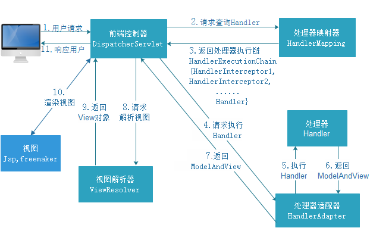
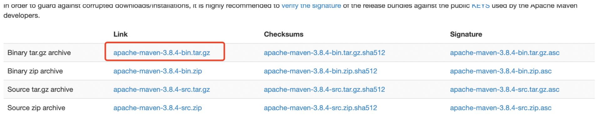
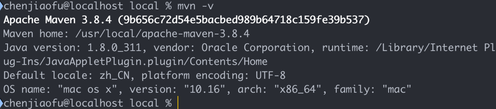

# Java基础

## equals和hashcode

​	hashcode 是通过散列方法进行计算获取唯一的hash值。在hashMap中将通过hash确认对象在桶的位置。即便是通过桶索引(bucketIndex)找到了对象也要调用一个或者多个equals方法去一个一个比较，成功了才属于真正的对象相等。因为一个桶里面只能装一个entry对象，但是entry对象是可以包含一个索引值去指向另一个entry，最终可以形成entry链；

​	equal是源于Object类，默认方法是去对比两个对象的引用，可以通过重写equal方法去自定义验证对象是否相等的新规则。

> hashcode详解  https://www.cnblogs.com/whgk/p/6071617.html 


## StringBuffer、StringBuilder和String

1）StringBuffer和StringBuilder初始化对象的时候是创建一个默认长度为16的char数组，修改都是针对char[]进行操作；String的底层是创建一个final 的char数组，他的操作是将引用对象指向新的对象。

2）StringBuffer是线程安全的，StringBuilder是线程不安全的。


## Java的重写和重载

1）重写是子类继承父类的方法进行重写，重载是同一个类下相同方法名，可以根据传参类型、传参个数的不同进行方法重载。

2）子类重写的方法名、返回类型、传参必须和父类完全相同，修饰符、异常范围必须小于等于父类；重载只要求方法名相同，传参数量和类型必须不同；


## HashMap的扩容机制

​	初始化HashMap时如果不传容量大小，默认16，加载因子为0.75；当容器容量乘上加载因子小于当前哈希条目时，进行扩容操作，每次扩容都是以2的指数倍进行扩容；

​	Java1.7在扩容时需要对每个元素进行rehash计算扩容后的hash地址，而1.8之后通过hash值和oldCap(旧容器大小)进行&位计算，得出新的hash地址；因为数组是以2的指数倍扩容，就相当于二进制中在多一个高位，如果高位是1，则将其调整到原索引加上oldCap的位置上，如果是0则无需调整。


## 为什么HashMap扩容的时候是二的指数倍

1）因为在二进制中2的指数减去1，这个结果n的二进制全部为1，再拿n去与hash值进行&位运算可以充分的散列，避免不必要的hash冲突。

2）由于2的二次幂关系，可以通过扩容后哈希值的二进制最高位是否为1来判断元素是否移位，优化性能。

## 范型擦除


# Spring框架

## 对Spring 的理解

1）Spring是一个开源框架

2）Spring是开源的，拥有庞大的且活跃的社区

3）Spring有两大核心：AOP(面向切面编程)和IOC(控制反转)

4）Spring的ORM和DAO提供了与第三方持久层框架的的良好整合，并简化了底层的数据库访问


## 对AOP的理解

​		AOP的意思是面向切面编程，任何一个系统都是由不同的组件组成的，每个组件负责一块特定的功能，当然会存在很多组件是跟业务无关的，例如日志、事务、权限等核心服务组件，这些核心服务组件经常融入到具体的业务逻辑中，如果我们为每一个具体业务逻辑操作都添加这样的代码，很明显代码冗余太多，因此我们需要将这些公共的代码逻辑抽象出来变成一个切面，然后注入到目标对象（具体业务）中去，AOP正是基于这样的一个思路实现的，通过动态代理的方式，将需要注入切面的对象进行代理，在进行调用的时候，将公共的逻辑直接添加进去，而不需要修改原有业务的逻辑代码，只需要在原来的业务逻辑基础之上做一些增强功能即可。

### proxy 

​	proxy是java内置的动态代理，其特点是无需第三方依赖；

​	proxy代理的底层逻辑是通过反射的原理，它是可以对多个不同的接口实现类中定义的方法进行代理；

### cglib

​	cglib的特点是需要导入第三方依赖；

​	cglib代理的底层逻辑是通过子类继承父类去重写方法的方式进行动态代理；


## 对IOC的理解

​	IOC（invest of controll） ，意思是控制反转，它是一种设计思想，并不是一种技术框架或者结构。在传统的创建对象中，是通过对象内部的new方法去实例一个对象，而IOC则是通过特定的容器去扫描注解，自动去创建依赖对象。

​	正转的意思是通过对象主动控制去直接获取依赖对象，而反转则是通过容器来帮忙创建和注入依赖对象。

​	IOC容器使用map结构来存储，在Spring中一般存在三级缓存，singletonObjects存放完整的bean对象，整个生命周期中，从创建到使用到销毁的过程都是由IOC容器来控制的。

### IOC底层逻辑

1.  容器创建过程设计的关键类（beanFactory，DefaultListableBeanFactory），向Bean工厂中设置参数涉及的关键类（BeanPostProcessor，Aware接口的子类）。
2. 加载解析bean对象，准备要创建的bean对象的定义对象beanDefintion（xml或者注解的解析过程）
3. beanFactoryPostProcessor的处理，此处是扩展点，PlaceHolderConfigurSupport，ConfigurationClassPostProcessor
4. BeanPostProcessor的注册功能，方便后续对bean对象完成具体的扩展功能（占位符的扩展）
5. BeanPostProcessor通过反射的方式实例化bean对象
6. bean对象的初始化过程（填充属性、调用aware子类的方法，调用BeanPostProcessor前置处理方法、调用init-method、调用BeanPostProcessor后置处理方法）
7. bean销毁过程

Bean生命周期流程中调用的关键方法：

getBean->doGetBean->createBean->doCreateBean->createBeanInstantce->populateBean->initializingBEan

## BeanFactory和ApplicationContext

相同:

- 它们两个都是spring下的IOC容器，都是Interface接口，ApplicationContext继承于BeanFactory（ApplicationContext集成于ListableBeanFactory，ListableBeanFactory继承于BeanFactory）
- 它们都可以用来配置XML属性，也支持属性的自动注入。

不同：

- BeanFactory在调用getBean()的时候才实例化Bean（懒加载），而ApplicationContext是在启动容器的时候实例化Bean（非懒加载）。
- 因为ApplicationContext是BeanFactory的扩展，提供了更多的功能:支持国际化、事件传递、Bean自动装配、各种不同应用层的Context实现。

## Spring扫描底层的原理

1. 首先，通过ResourcePatternResolver获得指定包路径下的所有 .class 文件（Spring源码中将此文件包装成了Resource对象)
2. 遍历每个Resource对象
3.  利用MetadataReaderFactory解析Resource对象得到MetadataReader（在Spring源码中MetadataReaderFactory具体的实现类为CachingMetadataReaderFactory，MetadataReader的具体实现类为SimpleMetadataReader）
4. 利用MetadataReader进行excludeFilters和includeFilters，以及条件注解@Conditional的筛选（条件注解并不能理解:某个类上是否存在@Conditional注解，如果存在则调用注解中所指定的类的match方法进行匹配，匹配成功则通过筛选，匹配失败则pass掉）
5. 筛选通过后，基于metadataReader生成ScannedGenericBeanDefinition
6. 再基于metadataReader判断是不是对应的类是不是接口或抽象类
7. 如果筛选通过，那么就表示扫描到了一个Bean，将ScannedGenericBeanDefinition加入结果集

## Spring是如何简化开发的

- 基于POJO的轻量级和最小侵入性编程
- 通过依赖注入和面向接口实现松耦合
- 基于切面和惯例进行声明式编程
- 通过切面和模板减少样板式代码


## Spring bean的生命周期

1）实例化（CreateBeanInstance）

​	在Java堆内存开辟空间，通过反射的方式生成对象

2）设置属性

1. 用户自定义属性赋值/注入依赖，如果出现循环依赖，需要解决循环依赖（populateBean()）
2. 容器对象赋值/调用Aware接口（invokeAwareMethods），完成BeanName，BeanFactroy，BeanClassLoader对象的属性设置

3）初始化 （Initialization）

1. 调用BeanPostProccessor的前置接口 postProcessBeforeInitialization() （ApplicationContextPostProcessor、ApplicationContext、Environment、ResourceLoader等对象）
2. InvokeInitMethod(),判断当前bean对象是否设置了InitializingBean接口，然后进行属性的设置等基本工作
3. 如果当前bean对象定义了初始化方法(afterPropertiesSet)，那么在此处调用初始化方法
4. 调用BeanPostProccessor的后置接口-postProcessAfterInitialization(), Spring中的Aop就是在这实现的(AbstractAutoProxyCreator)

4）调用对象(getBean)

5）销毁（Destruction）

1. DisposableBean的destory()方法
2. 自定义的destoryMethod指定方法


> 请别再问**Spring Bean**的生命周期了！ https://www.jianshu.com/p/1dec08d290c1
>
> **Bean的生命周期**流程图  https://www.processon.com/view/61a80d96e401fd49ed415987


## BeanFactory和FactoryBean

1. BeanFactory是负责生产和管理Bean的一个工厂接口，它是最基础的IOC容器，为其他IOC容器提供了规范。
2. FactoryBean是SpringIOC容器是创建Bean的一种方式，用户可以通过重写getObject()方法来自定义Bean的创建过程。


## Spring支持的Bean作用域

① singleton(默认)

​	使用该属性定义Bean时，IOC容器仅创建一个Bean实例，IOC容器每次返回的是同一个Bean实例。

② prototype

​	使用该属性定义Bean时，IOC容器可以创建多个Bean实例，每次返回的都是一个新的实例。

③ request

​	该属性仅对HTTP请求产生作用，使用该属性定义Bean时，每次HTTP请求都会创建一个新的Bean，适用于WebApplicationContext环境。

④ session

​	该属性仅用于HTTP Session，同一个Session共享一个Bean实例。不同Session使用不同的实例。

⑤ global-session

​	该属性仅用于HTTP Session，和session作用域不同的是，所有的Session共享一个Bean实例。


## Spring中Bean的线程安全

Spring中bean对象的默认是单例的，Spring中没有对bean进行多线程的封装，所以面对多线程问题最直接的方式就是把作用域改为prototype，这样在每次调用bean都是创建新的对象避免线程安全问题。

## Spring框架中使用的设计模式及应用场景

1. 工厂模式，在各种BeanFactory以及ApplicationContext创建中都用到了
2. 模版模式，在各种BeanFactory以及ApplicationContext实现中也都用到了
3. 代理模式，Spring AOP 利用了 AspectJ AOP实现的! AspectJ AOP 的底层用了动态代理
4. 策略模式，加载资源文件的方式，使用了不同的方法，比如：ClassPathResourece，FileSystemResource，ServletContextResource，UrlResource但他们都有共同的借口Resource；在Aop的实现中，采用了两种不同的方式，JDK动态代理和CGLIB代理
5. 单例模式，比如在创建bean的时候。
6. 观察者模式，spring中的ApplicationEvent，ApplicationListener,ApplicationEventPublisher
7. 适配器模式，MethodBeforeAdviceAdapter,ThrowsAdviceAdapter,AfterReturningAdapter
8. 装饰者模式，源码中类型带Wrapper或者Decorator的都使用了


## Spring事务的实现方式原理

​	Spring事务的本质其实就是数据库对事务的支持，没有数据库的事务支持，Spring是无法提供事务功能的。

​	在使用Spring框架的时候，可以有两种事务的实现方式，一种是编程式事务，有用户自己通过代码来控制事务的处理逻辑，还有一种是声明式事务，通过@Transactional注解来实现。

​	其实事务的操作本来应该是由数据库来进行控制，但是为了方便用户进行业务逻辑的操作，spring对事务功能进行了扩展实现，一般我们很少会用编程式事务，更多的是通过添加@Transactional注解来进行实现，当添加此注解之后事务的自动功能就会关闭，有spring框架来帮助进行控制。

​	其实事务操作是AOP的一个核心体现，当一个方法添加@Transactional注解之后，spring会基于这个类生成一个代理对象，会将这个代理对象作为bean，当使用这个代理对象的方法的时候，如果有事务处理，那么会先把事务的自动提交给关系，然后去执行具体的业务逻辑，如果执行逻辑没有出现异常，那么代理逻辑就会直接提交，如果出现任何异常情况，那么直接进行回滚操作，当然用户可以控制对哪些异常进行回滚操作。

## Spring事务的隔离级别

spring中的事务隔离级别就是数据库的隔离级别，有以下几种：

- read uncommitted （未提交读）      脏读、幻读、不可重复读
- read committed      （已提交读）      幻读、不可重复读
- repeatable read      （可重复读）       幻读
- serializable              （可串行化）       效率较低

在进行配置的时候，如果数据库和spring代码中的隔离级别不同，那么以spring的配置为主。

## Spring的事务传播机制

多个事务方法相互调用时，事务如何在这些方法之间进行传播,Spring中提供了7中不同的传播特性，来保证事务的正常执行：

​	REQUIRED：默认的传播特性，如果当前没有事务，则新建一个事务，如果当前存在事务，则加入这个事务

​	SUPPORTS：当前存在事务，则加入当前事务，如果当前没有事务，则以非事务的方式执行

​	MANDATORY：当前存在事务，则加入当前事务，如果当前事务不存在，则抛出异常

​	REQUIRED_NEW：创建新事务，无论当前存不存在事务，都创建新事务。

​	NOT_SUPPORTED：以非事务方式执行，如果存在当前事务，则挂起当前事务

​	NEVER：不使用事务，如果当前事务存在，则抛出异常

​	NESTED：如果当前存在事务，则在嵌套事务内执行。如果当前没有事务，则按REQUIRED属性执行。

​	NESTED和REQUIRED_NEW的区别：

​	REQUIRED_NEW是新建一个事务并且新开始的这个事务与原有事务无关，而NESTED则是当前存在事务时会开启一个嵌套事务，在NESTED情况下，父事务回滚时，子事务也会回滚，而REQUIRED_NEW情况下，原有事务回滚，不会影响新开启的事务

​	NESTED和REQUIRED的区别：

​	REQUIRED情况下，调用方存在事务时，则被调用方和调用方使用同一个事务，那么被调用方出现异常时，由于共用一个事务，所以无论是否catch异常，事务都会回滚，而在NESTED情况下，被调用方发生异常时，调用方可以catch其异常，这样只有子事务回滚，父事务不会回滚。

## Spring事务失效问题

1. bean对象没有被spring容器管理
2. 方法的访问修饰符不是public
3. 自身调用问题
4. 数据源没有配置事务管理器
5. 数据库不支持事务
6. 异常被捕获
7. 异常类型错误或者配置错误


## Spring中bean的自动装配的方式

bean的自动装配指的是bean的属性值在进行注入的时候通过某种特定的规则和方式去容器中查找，并设置到具体的对象属性中，主要有五种方式：

- no – 缺省情况下，自动配置是通过“ref”属性手动设定，在项目中最常用
- byName – 根据属性名称自动装配。如果一个bean的名称和其他bean属性的名称是一样的，将会自装配它。
- byType – 按数据类型自动装配，如果bean的数据类型是用其它bean属性的数据类型，兼容并自动装配它。
- constructor – 在构造函数参数的byType方式。
- autodetect – 如果找到默认的构造函数，使用“自动装配用构造”; 否则，使用“按类型自动装配”。


## 对SpringBoot的理解

- 用来简化Spring应用的初始搭建以及开发过程，使用特定的方式来进行配置
- 嵌入的tomcat无需部署war文件
- 简化maven配置
- 自动配置Spring添加对应的功能starter自动化配置


## 对SpringBoot中starter的理解

​	使用Spring+SpringMVC框架进行开发的时候，如果需要引入mybatis框架，那么需要在xml中定义需要的bean对象，这个过程很明显是很麻烦的，如果需要引入额外的其他组件，那么也需要进行复杂的配置，因此在SpringBoot中引入了Starter

​	Starter就是一个jar包，写一个@Configuration的配置类，将这些bean定义在其中，然后再Starter包的META-INF/spring.factories中写入配置类，那么SpringBoot程序在启动的时候就会按照约定来加载该配置类

​	开发人员只需要将相应的Starter包依赖进应用中，进行相关的属性配置，就可以进行代码开发，而不需要单独进行bean对象的配置

## bean的自动装配

​	bean的自动装配指的是bean的属性值在进行注入的时候通过某种特定的规则和方式去容器中查找，并设置到具体的对象属性中，主要有五种方式：

- no – 缺省情况下，自动配置是通过“ref”属性手动设定，在项目中最常用
- byName – 根据属性名称自动装配。如果一个bean的名称和其他bean属性的名称是一样的，将会自装配它。
- byType – 按数据类型自动装配，如果bean的数据类型是用其它bean属性的数据类型，兼容并自动装配它。
- constructor – 在构造函数参数的byType方式。
- autodetect – 如果找到默认的构造函数，使用“自动装配用构造”; 否则，使用“按类型自动装配”。
  ​		

## 对SpringMVC的理解

- SpringMVC是一种基于Spring实现了MVC设计模式的Web框架
- 将模型、视图、控制方法分离，实现职责解耦

## SpringMVC的工作流程

当发起请求时被前置的控制器拦截到请求，根据请求参数生成代理请求，找到请求对应的实际控制器，控制器处理请求，创建数据模型，访问数据库，将模型响应给中心控制器，控制器使用模型与视图渲染视图结果，将结果返回给中心控制器，再将结果返回给请求者。



1、DispatcherServlet表示前置控制器，是整个SpringMVC的控制中心。用户发出请求，DispatcherServlet接收请求并拦截请求。
2、HandlerMapping为处理器映射。DispatcherServlet调用HandlerMapping,HandlerMapping根据请求url查找Handler。
3、返回处理器执行链，根据url查找控制器，并且将解析后的信息传递给DispatcherServlet
4、HandlerAdapter表示处理器适配器，其按照特定的规则去执行Handler。
5、执行handler找到具体的处理器
6、Controller将具体的执行信息返回给HandlerAdapter,如ModelAndView。
7、HandlerAdapter将视图逻辑名或模型传递给DispatcherServlet。
8、DispatcherServlet调用视图解析器(ViewResolver)来解析HandlerAdapter传递的逻辑视图名。
9、视图解析器将解析的逻辑视图名传给DispatcherServlet。
10、DispatcherServlet根据视图解析器解析的视图结果，调用具体的视图，进行试图渲染
11、将响应数据返回给客户端

## SpringMVC的主要组件

1.**HandlerMapping(处理器映射器)**
根据request找到相应的处理器。因为Handler（Controller）有两种形式，一种是基于类的Handler，另一种是基于Method的Handler（也就是我们常用的）

2.**HandlerAdapter(处理器适配器)**
调用Handler的适配器。如果把Handler（Controller）当做工具的话，那么HandlerAdapter就相当于干活的工人

3.**HandlerExceptionResolver(处理器异常解析器)**
对异常的处理

4.**ViewResolver (视图解析器)**
用来将String类型的视图名和Locale解析为View类型的视图

5.**RequestToViewNameTranslator**
有的Handler（Controller）处理完后没有设置返回类型，比如是void方法，这是就需要从request中获取viewName

6.**LocaleResolver**
从request中解析出Locale。Locale表示一个区域，比如zh-cn，对不同的区域的用户，显示不同的结果，这就是i18n（SpringMVC中有具体的拦截器LocaleChangeInterceptor）

7.**ThemeResolver**
主题解析，这种类似于我们手机更换主题，不同的UI，css等

8.**MultipartResolver**
处理上传请求，将普通的request封装成MultipartHttpServletRequest

9.**FlashMapManager**
用于管理FlashMap，FlashMap用于在redirect重定向中传递参数


# 设计模式

## 设计模式七大原则

### 单一职责原则(Single responsibility principle)

​	对类来说，一个类只负责一个职责；如果一个类有两个职责A和B，当A职责的需求改变是可能造成B职责的代码执行错误，那么就需要将A的代码块分为两部分，所以不如一开始就将类的职责统一；

### 接口隔离原则(Interface Segregation Principle)

​	客户端不应该依赖(实现)它不需要的接口，即一个类对另一个类的依赖(实现)应该建立在最小的接口上，即将接口尽可能按需拆分为最小接口。

### 依赖倒转原则(Dependence Inversion Principle)

​	高层模块不应该依赖(实现)低层模块的代码，二者都应该依赖其接口/抽象类。  

### 里氏替换原则(Liskov Substitution Principle)

1. 所有引用到父类的地方都能使用子类（使用子类中父类方法结果不变）
2. 在子类中尽量不要重写父类的方法
3. 在适当情况下，可以通过聚合、组合、依赖来解决问题

### 开闭原则(Open Close Principle)

​	开闭原则就是说对**提供方**提供扩展开放，对**接收方**修改关闭。用抽象构建框架，用实现扩展细节；

​	大致意思就是，**接受方**使用了**提供方**提供的方法B，而**提供方**将方法B进行了扩展，**接收方**继续调用方法B时并不需要修改代码，程序依旧正常执行；

### 迪米特法则(Demeter Principle)

迪米特法则又叫最少知道原则，即一个类对自己依赖的类知道的越少越好。也就是说，对于被依赖的类不管多么复杂，都尽量将逻辑封装在类的内部。对外除了提供public方法，不对外泄漏任何信息。

陌生的类最好不要以局部变量的形式出现在类的内部。	

### 合成服用原则(Composite Reuse Principle)

原则是尽量使用合成/聚合的方式，而不是使用继承。


## 行为型模式

### 访问者模式

封装一些作用于某种数据结构中的各元素的操作，它可以在不改变数据结构的前提下定义作用于这些元素的新的操作。

**使用场景:**

1. 一个对象结构包含很多类对象，它们有不同的接口，而你想对这些对象实施一些依赖于其具体类的操作，也就说是用迭代器模式已经不能胜任的情景。

2. 需要对一个对象结构中的对象进行很多不同并且不相关的操作，而你想避免让这些操作“污染”这些对象的类。

### 模板模式

定义一个操作中的算法的框架，而将一些步骤延迟到子类中。使得子类可以不改变一个算法的结构即可重定义该算法的某些特定步骤。

**使用场景:**

1. 多个子类有公有的方法，并且逻辑基本相同时。

2. 重要、复杂的算法，可以把核心算法设计为模板方法，周边的相关细节功能则由各个子类实现。

3. 重构时，模板方法模式是一个经常使用的模式，把相同的代码抽取到父类中，然后通过钩子函数（见“模板方法模式的扩展”）约束其行为。

### 策略模式

定义一组算法，将每个算法都封装起来，并且使它们之间可以互换。

**使用场景:**

1. 多个类只有在算法或行为上稍有不同的场景。

2. 算法需要自由切换的场景。

3. 需要屏蔽算法规则的场景。

### 状态模式

当一个对象内在状态改变时允许其改变行为，这个对象看起来像改变了其类。

**使用场景：**

1. 行为随状态改变而改变的场景这也是状态模式的根本出发点，例如权限设计，人员的状态不同即使执行相同的行为结果也会不同，在这种情况下需要考虑使用状态模式。

2. 条件、分支判断语句的替代者

### 观察者模式

定义对象间一种一对多的依赖关系，使得每当一个对象改变状态，则所有依赖于它的对象都会得到通知并被自动更新。

1、观察者接口

```java
public interface Observer {
    void response();
}
```

2、实现类

```java
public class ConcreteObserver2 implements Observer {
    @Override
    public void response() {
        System.out.println("1号观察者作出反应！");
    }
}
public class ConcreteObserver2 implements Observer {
    @Override
    public void response() {
        System.out.println("2号观察者作出反应！");
    }
}
```

3、抽象目标

```java
public abstract class Subject {
    //定义一个观察者数组
    protected Vector<Observer> obsVector = new Vector();

    //增加一个观察者
    public void addObserver(Observer o) {
        this.obsVector.add(o);
    }

    //删除一个观察者
    public void delObserver(Observer o) {
        this.obsVector.remove(o);
    }

    //通知观察者方法
    public abstract void notifyObserver();

}
```

4、真实目标

```java
public class ConcreteSubject extends Subject{
    @Override
    public void notifyObserver() {
        for (Observer obs : obsVector) {
            obs.response();
        }
    }

		//测试方法
    public static void main(String[] args) {
        Subject subject=new ConcreteSubject();
        Observer concreteSubject1=new ConcreteObserver1();
        Observer concreteSubject2=new ConcreteObserver2();
        subject.addObserver(concreteSubject1);
        subject.addObserver(concreteSubject2);

        subject.notifyObserver();
    }
}

```

**使用场景:**

1. 关联行为场景。需要注意的是，关联行为是可拆分的，而不是“组合”关系。

2. 事件多级触发场景。

3. 跨系统的消息交换场景，如消息队列的处理机制

### 备忘录模式

在不破坏封装性的前提下，捕获一个对象的内部状态，并在该对象之外保存这个状态。这样以后就可将该对象恢复到原先保存的状态。

```java
//备忘录
public class Memento {
    String state;

    Memento(String state) {
        this.state = state;
    }

    public String getState() {
        return state;
    }

    public void setState(String state) {
        this.state = state;
    }

}

//备忘录模式
public class Originator {
    private String state;
    /**
     * 工厂方法，返回一个新的备忘录对象
     */
    public Memento createMemento() {
        return new Memento(state);
    }

    /**
     * 将发起人恢复到备忘录对象所记载的状态
     */
    public void restoreMemento(Memento memento) {
        this.state = memento.getState();
    }

    public String getState() {
        return state;
    }

    public void setState(String state) {
        this.state = state;
        System.out.println("当前状态：" + this.state);
    }
}
```

**使用场景：**

1. 需要保存和恢复数据的相关状态场景。

2. 提供一个可回滚（rollback）的操作。

3. 需要监控的副本场景中。

4. 数据库连接的事务管理就是用的备忘录模式。

### 中介者模式

用一个中介对象封装一系列的对象交互，中介者使各对象不需要 显示地相互作用，从而使其耦合松散，而且可以独立地改变它们之间的交互。

```java
public class Mediator {
    //定义同事类
    protected ConcreteColleague1 c1;
    protected ConcreteColleague2 c2;

    //通过getter/setter方法把同事类注入进来
    public ConcreteColleague1 getC1() {
        return c1;
    }

    public void setC1(ConcreteColleague1 c1) {
        this.c1 = c1;
    }

    public ConcreteColleague2 getC2() {
        return c2;
    }

    public void setC2(ConcreteColleague2 c2) {
        this.c2 = c2;
    }
    //中介者模式的业务逻辑
    public abstract void doSomething1();

    public abstract void doSomething2();
}

```

**使用场景：** 

​	中介者模式适用于多个对象之间紧密耦合的情况，紧密耦合的标准是：在类图中 出现了蜘蛛网状结构，即每个类都与其他的类有直接的联系。

### 迭代器模式

它提供一种方法访问一个容器对象中各个元素，而又不需暴露该对象的内部细节。

迭代器模式已经被淘汰，java中已经把迭代器运用到各个聚集类（collection）中了，使用java自带的迭代器就已经满足我们的需求了。

### 解释器模式

给定一门语言，定义它的文法的一种表示，并定义一个解释器，该解释器使用该表示来解释语言中的句子。

**使用场景:**

1. 重复发生的问题可以使用解释器模式
2. 一个简单语法需要解释的场景

### 命令模式

将一个请求封装成一个对象,从而让你使用不同的请求把客户端参数化,对请求排队或者记录请求日志,可以提供命令的撤销和恢复功能。

Receiver接受者角色:该角色就是干活的角色,命令传递到这里是应该被执行的

Command命令角色:需要执行的所有命令都在这里声明

Invoker调用者角色:接收到命令,并执行命令

```java
//通用Receiver类 
public abstract class Receiver {
    public abstract void doSomething();
}

//具体Receiver类 
public class ConcreteReciver1 extends Receiver {
    //每个接收者都必须处理一定的业务逻辑 
    public void doSomething() {
    }
}

public class ConcreteReciver2 extends Receiver {
    //每个接收者都必须处理一定的业务逻辑 
    public void doSomething() {
    }
}

//抽象Command类 
public abstract class Command {
    public abstract void execute();
}

//具体的Command类 
public class ConcreteCommand1 extends Command {
    //对哪个Receiver类进行命令处理 
    private Receiver receiver;

    //构造函数传递接收者 
    public ConcreteCommand1(Receiver _receiver) {
        this.receiver = _receiver;
    }

    //必须实现一个命令 
    public void execute() {
        //业务处理
        this.receiver.doSomething();
    }
}

public class ConcreteCommand2 extends Command {
    //哪个Receiver类进行命令处理 
    private Receiver receiver;

    //构造函数传递接收者
    public ConcreteCommand2(Receiver _receiver) {
        this.receiver = _receiver;
    }

    //必须实现一个命令 
    public void execute() {
        //业务处理 
        this.receiver.doSomething();
    }
}

//调用者Invoker类
public class Invoker {
    private Command command;

    public void setCommand(Command _command) {
        this.command = _command;
    }

    public void action() {
        this.command.execute();
    }
}

//场景类 
public class Client {
    public static void main(String[] args) {
        Invoker invoker = new Invoker();
        Receiver receiver = new ConcreteReceiver1();
        Command command = new ConcreteCommand1(receiver);
        invoker.setCommand(command);
        invoker.action();
    }
}
```

**使用场景：**

认为是命令的地方就可以采用命令模式，例如，在GUI开发中，一个按钮的点击 是一个命令，可以采用命令模式；模拟DOS命令的时候，当然也要采用命令模式；触发－反馈机制的处理等。

### 责任链模式

使多个对象都有机会处理请求，从而避免了请求的发送者和接受者之间的耦合关系。将这些对象连成一条链，并沿着这条链传递该请求，直到有对象处理它为止。

```java
package com.example.test.DesignMode;

import org.omg.CORBA.Request;

import javax.xml.ws.Response;
import java.util.logging.Level;

public abstract class Handler {
    private Handler nextHandler;
    //每个处理者都必须对请求做出处理

    public final Response handleMessage(Request request) {
        Response response = null;
        //判断是否是自己的处理级别 
        if (this.getHandlerLevel().equals(request.getRequestLevel())) {
            response = this.echo(request);
        } else {
            //不属于自己的处理级别 
            // 判断是否有下一个处理者 
            if (this.nextHandler != null) {
                response = this.nextHandler.handleMessage(request);
            } else {
                //没有适当的处理者，业务自行处理 
            }
        }
        return response;
    }

    //设置下一个处理者是谁 
    public void setNext(Handler _handler) {
        this.nextHandler = _handler;
    }

    //每个处理者都有一个处理级别
    protected abstract Level getHandlerLevel();

    //每个处理者都必须实现处理任务 
    protected abstract Response echo(Request request);
}

```


## 创建型模式

### 单例模式

所谓类的单例设计模式，就是采用一定的方法保证在整个的软件系统中，对某个类只能存在一个对象实例，并且该类只提供一个获取该实例的方法(静态方法)。

单例模式保证了系统内部中该类只存在一个对象，节省了系统资源，对于一些需要频繁创建销毁的对象，使用单例模式可以提高系统性能。

------

**单例设计模式八种方式：**

**1、饿汉式(静态常量)**

```java
public class Singleton {

    //构造器私有化，防止外部new
    private  Singleton() {
    }

    //本类内部创建对象实例
    private final static Singleton instantce = new Singleton();

    //提供一个公有静态方法，返回实例对象
    public static Singleton getInstance() {
        return instantce;
    }
}

```

优点：在类加载的时候就完成了实例化，避免了线程同步问题。

缺点：在类加载的时候就完成了实例化，如果从始至终没有使用这个实例，则会造成内存的浪费。

------

**2、饿汉式(静态代码块)**

```java
public class Singleton {

    //构造器私有化，防止外部new
    private  Singleton() {
    }

    //本类内部创建对象实例
    private static Singleton instantce;

    //在静态方法块中，创建单例对象
    static {
        instantce = new Singleton();
    }

    //提供一个公有静态方法，返回实例对象
    public static Singleton getInstance() {
        return instantce;
    }
}
```

优缺点与静态常量写法一致

------

**3、懒汉式(线程不安全)**

```java
public class Singleton {

    private static Singleton instantce;

    //构造器私有化，防止外部new
    private Singleton() {
    }

    //提供一个静态的公有方法，当使用到该方法时，才去进行实例化
    public static Singleton getInstance() {
        if (instantce == null) {
            instantce = new Singleton();
        }
        return instantce;
    }
}
```

优点：避免内存的浪费

缺点：当两个线程同时走进了if语句块时，便会产生多个实例，多线程下破坏单例模式，线程不安全。

------

**4、懒汉式(线程安全，同步方法)**

```java
public class Singleton {

    private static Singleton instantce;

    private Singleton() {
    }

    //加入同步代码，解决线程不安全问题
    public static  synchronized Singleton getInstance() {
        if (instantce == null) {
            instantce = new Singleton();
        }
        return instantce;
    }
}
```

虽然解决了线程不安全问题，由于加了synchronized效率过低。

------

**5、懒汉式(线程不安全，同步方法块)**

```java
public class Singleton {

    private static Singleton instantce;

    private Singleton() {
    }

    public static  Singleton getInstance() {
        if (instantce == null) {
            //加入同步代码块，解决线程不安全问题
            synchronized (Singleton.class){
                instantce = new Singleton();
            }
        }
        return instantce;
    }
}
```

效率问题虽然解决了，但是线程安全问题又出现了

------

**6、双重检查(DCL)**

```java
public class Singleton {

    private  static volatile Singleton instantce;

    private Singleton() {
    }
    //加入双重检查解决线程安全问题
    public static  Singleton getInstance() {
        if (instantce == null) {
            synchronized (Singleton.class){
                if (instantce ==null){
                    instantce = new Singleton();
                }
            }
        }
        return instantce;
    }
}
```

解决了线程安全问题，也大大提高了效率。

------

**7、静态内部类**

```java
public class Singleton {

    private Singleton() {
    }

    //写一个静态内部类，该类中有一个私有属性Singleton
    //在Singleton进行类加载时，并不会对静态内部类进行加载。
    private static class SingletonInstance{
        private static final Singleton INSTANCE = new Singleton();
    }

    //提供一个静态公有方法，直接返回SingletonInstance.INSTANCE
    public static Singleton getInstance(){
        return SingletonInstance.INSTANCE;
    }
}

```

静态内部类的特点：在类加载(Singleton)时不会对静态内部类进行加载(SingletonInstance)

优点：

- 采用类加载机制来保证初始化实例只有一个线程
- 静态内部类方式在Singleton类被装载时并不会立即实例化，只有在调用getInstance方法时，去装在静态内部类SingletonInstance，从而完成Singleton的实例化。
- 类的静态属性只会在第一次加载类的时候进行初始化，所以在这里JVM，帮助我们保证了线程的安全性，在类进行初始化时，别的线程是无法进入的

------

**8、枚举**

```java
public class SingletonTest {
    enum Singleton {
        INSTANCE;
    }
    public static void main(String[] args) {
        Singleton s1=Singleton.INSTANCE;
        Singleton s2=Singleton.INSTANCE;
        System.out.println(s1==s2); //true
        System.out.println(s1.hashCode()==s2.hashCode());//true

    }
   
}
```

借助了jdk1.5中添加的枚举来实现单例模式。不仅解决了多线程同步问题，而且还能防止反序列化重写创建对象。

### 工厂方法模式

工厂方法模式分为两种种：

**1、简单工厂方法模式**

我们把被创建的对象称为“产品”，把创建产品的对象称为“工厂”。如果要创建的产品不多，只要一个工厂类就可以完成，这种模式叫“简单工厂模式”。

在简单工厂模式中创建实例的方法通常为静态方法，因此简单工厂模式又叫作静态工厂方法模式。

简单来说，简单工厂模式有一个具体的工厂类，可以生成多个不同的产品，属于创建型设计模式。

简单工厂模式每增加一个产品就要增加一个具体产品类和一个对应的具体工厂类，这增加了系统的复杂度，违背了“开闭原则”。

1、定义发送消息接口

```java
public interface Sender {
	public void Send();
}
```

2、创建实现类

```java
//邮箱发送
public class MailSender implements Sender {
	@Override
	public void Send() {
		System.out.println("这是邮箱发送!");
	}
}
//手机短信
public class PhoneSender implements Sender {
 
	@Override
	public void Send() {
		System.out.println("这是手机短信发送!");
	}
}
```

3、创建工厂类

```java
public class SendFactory {
 
	public Sender produce(String type) {
		if ("mail".equals(type)) {
			return new MailSender();
		} else if ("phone".equals(type)) {
			return new PhoneSender();
		} else {
			System.out.println("请输入正确的类型!");
			return null;
		}
	}
}
```

4、测试结果

```java
public class FactoryTest {
 
	public static void main(String[] args) {
		SendFactory factory = new SendFactory();
		Sender sender = factory.produce("phone");
		sender.Send();
    //输出：这是手机短信发送!
	}
}
```


**2、普通工厂方法模式**

普通工厂方法模式是对简单工厂模式的进一步抽象化，其好处是可以使系统在不修改原来代码的情况下引进新的产品。


将上面的代码做下修改，改动下SendFactory类就行，如下：

```java
public class SendFactory {
 
	public Sender produceMail(){
		return new MailSender();
	}
	
	public Sender producePhone(){
		return new PhoneSender();
	}
}
```

测试类:

```java
public class FactoryTest {
 
	public static void main(String[] args) {
		SendFactory factory = new SendFactory();
		Sender sender = factory.produceMail();
		sender.Send();
    //输出: 这是邮箱发送!
	}
}
```

使用场景：jdbc连接数据库，硬件访问，降低对象的产生和销毁

### 抽象工厂模式

定义了一个interface用于创建相关或有依赖关系的对象簇，而无需指明具体的类。他是由简单工厂和工厂方法模式的整合，更利于代码的维护和扩展。

1、定义两个接口

```java
//发送接口
public interface Sender {
	public void Send();
}
//提供具体工厂接口
public interface Provider {
	public Sender produce();
}
```

2、实现类

```java
public class MailSender implements Sender {
	@Override
	public void Send() {
		System.out.println("this is mailsender!");
	}
}

public class SmsSender implements Sender {
 
	@Override
	public void Send() {
		System.out.println("this is sms sender!");
	}
}
```

3、工厂类

```java
public class SendMailFactory implements Provider {
	@Override
	public Sender produce(){
		return new MailSender();
	}
}

public class SendSmsFactory implements Provider{
 
	@Override
	public Sender produce() {
		return new SmsSender();
	}
}
```

4、测试类

```java
public class Test {
 
	public static void main(String[] args) {
		Provider provider = new SendMailFactory();
		Sender sender = provider.produce();
		sender.Send();
	}
}
```

这个模式的好处就是，如果你现在想增加一个功能：发及时信息，则只需做一个实现类，实现Sender接口，同时做一个工厂类，实现Provider接口，就OK了，无需去改动现成的代码。这样做，拓展性较好！


使用场景：一个对象族（或是一组没有任何关系的对象）都有相同的约束。涉及不同操作系统的时候，都可以考虑使用抽象工厂模式

### 建造者模式

将一个复杂对象的构建与它的表示分离，使得同样的构建过程可以创建不同的表示。

```java
package com.example.test.DesignMode;

public class Build {
    static class Student {
        String name = null;
        int number = -1;
        String sex = null;

        public Student(Builder builder) {
            this.name = builder.name;
            this.number = builder.number;
            this.sex = builder.sex;
        }

        static class Builder {
            String name = null;
            int number = -1;
            String sex = null;

            public Builder setName(String name) {
                this.name = name;
                return this;
            }

            public Builder setNumber(int number) {
                this.number = number;
                return this;
            }

            public Builder setSex(String sex) {
                this.sex = sex;
                return this;
            }
						//在此方法构建
            public Student build() {
                return new Student(this);
            }
        }
    }

    public static void main(String[] args) {
        Student A = new Student.Builder().setName("张 三").setNumber(1).build();
        Student B = new Student.Builder().setSex("男").setName("李 四").build();
        System.out.println(A.name + " " + A.number + " " + A.sex);//张 三 1 男
        System.out.println(B.name + " " + B.number + " " + B.sex);//李 四 -1 男
    }
}
```

在JDK中，StringBulider用到了建造者模式。

### 原型模式

用原型实例指定创建对象的种类，并且通过拷贝这些原型创建新的对象。

```java
package com.example.test.DesignMode;

//原型模式
public class Prototype implements Cloneable {
    private String name;

    Prototype(){
        this.name="初始化";
    }

    public String getName() {
        return name;
    }

    public void setName(String name) {
        this.name = name;
    }

    @Override
    protected Object clone() {
        try {
            return super.clone();
        } catch (CloneNotSupportedException e) {
            e.printStackTrace();
        }
        return null;
    }

    public static void main(String[] args) {
        Prototype pro = new Prototype();
        pro.setName("pro");
        Prototype pro1 = (Prototype) pro.clone();
        System.out.println(pro==pro1);//false
        System.out.println(pro.hashCode()==pro1.hashCode());//false
    }
}
```

**使用原型模式的优点**：

1.性能优良

原型模式是在内存二进制流的拷贝，性能要比直接new一个对象快，在一个循环体内new大量对象时，原型模式可以更好地体现其优点。

2.不会执行对象的构造函数

**使用场景**：

资源优化场景类初始化需要消化非常多的资源，这个资源包括数据、硬件资源等。

性能和安全要求的场景通过new产生一个对象需要非常繁琐的数据准备或访问权限，则可以使用原型模式。

一个对象多个修改者的场景 一个对象需要提供给其他对象访问，而且各个调用者可能都需要修改其值时，可以考虑使用原型模式拷贝多个对象供调用者使用。


## 结构型模式

### 适配器模式

将一个类的接口变换成客户端所期待的另一种接口，从而使原本因接口不匹配而无法在一起工作的两个类能够在一起工作。

主要可分为3种：

- 类适配：创建新类，继承源类，并实现新接口，例如 class adapter extends oldClass implements newFunc{}
- 对象适配：创建新类持源类的实例，并实现新接口，例如 class adapter implements newFunc { private oldClass oldInstance;}
- 接口适配：创建新的抽象类实现旧接口方法。例如 abstract class adapter implements oldClassFunc { void newFunc();}

**使用场景**：

你有动机修改一个已经投产中的接口时，适配器模式可能是适合你的模式。比如系统扩展了，需要使用一个已有或新建立的类，但这个类又不符合系统的接口，怎么办？使用适配器模式，这也是我们例子中提到的。

### 桥接模式(桥梁模式)

将抽象和实现解耦，使得两者可以独立地变化

Circle类将DrwaApi与Shape类进行了桥接

1、定义接口

```java
//绘画接口
public interface DrawAPI {
     void drawCircle(int radius, int x, int y);
}
```

2、实现类

```java
//实现类-画红色的圆
public class RedCircle implements DrawAPI {
    @Override
    public void drawCircle(int radius, int x, int y) {
        System.out.println("Drawing Circle[ color: red, radius: " + radius +", x: " +x+", "+ y +"]");
    }
}
//实现类-画绿色的圆
public class GreenCircle implements DrawAPI {
    @Override
    public void drawCircle(int radius, int x, int y) {
        System.out.println("Drawing Circle[ color: green, radius: " + radius +", x: " +x+", "+ y +"]");
    }
}

```

3、抽象类

```java
abstract class Shape {
    protected DrawAPI drawAPI;

    protected Shape(DrawAPI drawAPI) {
        this.drawAPI = drawAPI;
    }

    public abstract void draw();
}
```

4、形状类以及测试类

```java
class Circle extends Shape {
    private int x, y, radius;

    public Circle(int x, int y, int radius, DrawAPI drawAPI) {
        super(drawAPI);
        this.x = x;
        this.y = y;
        this.radius = radius;
    }

    public void draw() {
        drawAPI.drawCircle(radius, x, y);
    }

    public static void main(String[] args) {
        Shape redCircle = new Circle(100, 100, 10, new RedCircle());
        Shape greenCircle = new Circle(100, 100, 10, new GreenCircle());
        redCircle.draw();
        greenCircle.draw();
    }
}

```

**使用场景:**

1. 不希望或不适用使用继承的场景

2. 接口或抽象类不稳定的场景

3. 重用性要求较高的场景

### 组合模式

将对象组合成树形结构以表示“部分-整体”的层次结构，使得用户对单个对象和组合对象的使用具有一致性。

```java
public class Composite extends Component {
    //构件容器
    private ArrayList componentArrayList = new ArrayList();

    //增加一个叶子构件或树枝构件
    public void add(Component component) {
        this.componentArrayList.add(component);
    }

    //删除一个叶子构件或树枝构件
    public void remove(Component component) {
        this.componentArrayList.remove(component);
    }

    //获得分支下的所有叶子构件和树枝构件
    public ArrayList getChildren() {
        return this.componentArrayList;
    }
}
```

**使用场景:**

1. 维护和展示部分-整体关系的场景，如树形菜单、文件和文件夹管理。

2. 从一个整体中能够独立出部分模块或功能的场景。

### 装饰器模式

动态地给一个对象添加一些额外的职责。就增加功能来说，装饰器模式相比生成子类更为灵活 。

```java
public interface Source
{
    void method();
}

public class Decorator implements Source {
    private Source source ;

    public void decorate() {
        System.out.println("decorate");
    }

    @Override
    public void method() {
      	//在方法调用前进行装饰
        decorate();
        source.method();
    }
}
```

**使用场景:**

1. 需要扩展一个类的功能，或给一个类增加附加功能。

2. 需要动态地给一个对象增加功能，这些功能可以再动态地撤销。

3. 需要为一批的兄弟类进行改装或加装功能，当然是首选装饰模式。


### 外观模式(门面模式)

要求一个子系统的外部与其内部的通信必须通过一个统一的对象进行。外观模式提供一个高层次的接口，使得子系统更易于使用。

```java
public class Facade {
    private SubSystem1 subSystem1 = new SubSystem1();
    private SubSystem2 subSystem2 = new SubSystem2();
    private SubSystem3 subSystem3 = new SubSystem3();

    public void startSystem() {
        subSystem1.start();
        subSystem2.start();
        subSystem3.start();
    }

    public void stopSystem() {
        subSystem1.stop();
        subSystem2.stop();
        subSystem3.stop();
    }
}
```

**使用场景：**

1. 为一个复杂的模块或子系统提供一个供外界访问的接口

2. 子系统相对独立——外界对子系统的访问只要黑箱操作即可

3. 预防低水平人员带来的风险扩散

### 亨元模式

使用共享对象的方法，用来尽可能减少内存使用量以及分享资讯。

1、抽象类-flywei

```java
abstract class flywei {}
```

2、对象-Flyweight

```java
public class Flyweight extends flywei {
    Object obj;

    public Flyweight(Object obj) {
        this.obj = obj;
    }
}
```

3、工厂类-FlyweightFactory

```java
public class FlyweightFactory {
    private HashMap data;

    public FlyweightFactory() {
        data = new HashMap<>();
    }

    public Flyweight getFlyweight(Object object) {
        if (data.containsKey(object)) {
            return (Flyweight) data.get(object);
        } else {
            Flyweight flyweight = new Flyweight(object);
            data.put(object, flyweight);
            return flyweight;
        }
    }
}
```

**使用场景：**

1. 系统中存在大量的相似对象。

2. 细粒度的对象都具备较接近的外部状态，而且内部状态与环境无关，也就是说对象没有特定身份。

3. 需要缓冲池的场景。

### 代理模式

为其他对象提供一种代理以控制对这个对象的访问。

1、创建接口-Source

```java
public interface Source {
    void method();
}
```

2、继承类-OldClass

```
public class OldClass  implements Source {
    @Override
    public void method() {

    }
}
```

3、代理类

```java
//代理模式
public class Proxy implements Source {
    private Source source = new OldClass();

    void doSomething() {
    }

    @Override
    public void method() {
        preRequest();
        source.method();
        postRequest();
        doSomething();
    }

    public void preRequest() {
        System.out.println("访问具体方法前操作");
    }

    public void postRequest() {
        System.out.println("访问具体方法后操作");
    }
}
```


> Java之美[从菜鸟到高手演变]之设计模式   https://blog.csdn.net/zhangerqing/article/details/8194653


# Mybatis

## Mybatis的优缺点

**优点**：

- JDBC相比，减少了50%以上的代码量，消除了JDBC大量冗余的代码，不需要手动开关连接；
- 很好的与各种数据库兼容（因为MyBatis使用JDBC来连接数据库，所以只要JDBC支持的数据库MyBatis都支持，而JDBC提供了可扩展性，所以只要这个数据库有针对Java的jar包就可以就可以与MyBatis兼容），开发人员不需要考虑数据库的差异性。
- 提供了很多第三方插件（分页插件 / 逆向工程）
- 能够与Spring很好的集成
- MyBatis相当灵活，不会对应用程序或者数据库的现有设计强加任何影响，SQL写在XML里，从程序代码中彻底分离，解除sql与程序代码的耦合，便于统一管理和优化，并可重用
- 提供XML标签，支持编写动态SQL语句
- 提供映射标签，支持对象与数据库的ORM字段关系映射
- 提供对象关系映射标签，支持对象关系组建维护

**缺点**：

- SQL语句的编写工作量较大，尤其是字段多、关联表多时，更是如此，对开发人员编写SQL语句的功底有一定要求
- SQL语句依赖于数据库，导致数据库移植性差，不能随意更换数据库

## Mybatis中#{}和${}的区别

- #{}是预编译处理，${}是字符串替换
- Mybatis 在处理#{}时，会将 sql 中的#{}替换为?号，调用 PreparedStatement 的 set 方法来赋值；
- Mybatis 在处理${}时，就是把${}替换成变量的值
- 使用#{}可以有效的防止 SQL 注入，提高系统安全性

## Mybatis分页

Mybatis 使⽤ RowBounds 对象进⾏分⻚，它是针对 ResultSet 结果集执⾏的内存分⻚，⽽⾮物理分⻚，可以在 sql 内直接书写带有物理分⻚的参数来完成物理分⻚功能，也可以使⽤分⻚插件来完成物理分⻚。

分⻚插件的基本原理是使⽤ Mybatis 提供的插件接⼝，实现⾃定义插件，在插件的拦截⽅法内拦截待执⾏的 sql，然后重写 sql，根据 dialect ⽅⾔，添加对应的物理分⻚语句和物理分⻚参数。

## Mybatis延迟加载

Mybatis 仅⽀持 association 关联对象和 collection 关联集合对象的延迟加载，association指的就是⼀对⼀，collection 指的就是⼀对多查询。在 Mybatis 配置⽂件中，可以配置是否启⽤延迟加载 `lazyLoadingEnabled=true|false`。

它的原理是，使⽤ **CGLIB** 创建⽬标对象的代理对象，当调⽤⽬标⽅法时，进⼊拦截器⽅法，⽐如调⽤`a.getB().getName()` ，拦截器 invoke() ⽅法发现 `a.getB()` 是 null 值，那么就会单独发送先保存好的查询关联 B 对象的 sql，把 B 查询上来，然后调⽤ `a.setB(b)`，于是 a 的对象 b 属性就有值了，接着完成 `a.getB().getName()` ⽅法的调⽤。这就是延迟加载的基本原理。


## Mybatis插件运行原理及开发流程

mybatis只支持针对`ParameterHandler`、`ResultSetHandler`、`StatementHandler`、`Executor`这四种接口的插件，mybatis使用jdk的动态代理，为需要拦截的接口生成代理对象以实现接口方法拦截功能，每当执行这四种接口对象的方法时，就会进入拦截方法，具体就是`InvocationHandler`的`invoke`方法，拦截那些你指定需要拦截的方法。

编写插件：实现Mybatis的Interceptor接口并复写intercept方法啊，然后给插件编写注解，指定要拦截哪一个接口的哪些方法，在配置文件中配置编写的插件即可。

```java
@Intercepts({@Signature(type = StatementHandler.class,method = "parameterize",args = Statement.class)})
```

## Mybatis 是如何将 sql 执⾏结果封装为⽬标对象并返回的？都有哪些映射形式？

第⼀种是使⽤ `<resultMap>` 标签，逐⼀定义列名和对象属性名之间的映射关系。第⼆种是使⽤sql 列的别名功能，将列别名书写为对象属性名，⽐如 T_NAME AS NAME，对象属性名⼀般是 name，⼩写，但是列名不区分⼤⼩写，Mybatis 会忽略列名⼤⼩写，智能找到与之对应对象属性名，你甚⾄可以写成 T_NAME AS NaMe，Mybatis ⼀样可以正常⼯作。

有了列名与属性名的映射关系后，Mybatis 通过反射创建对象，同时使⽤反射给对象的属性逐⼀赋值并返回，那些找不到映射关系的属性，是⽆法完成赋值的。


# JVM

## 结构概览


JVM包含两个子系统和两个组件，两个子系统为Class loader(类装载)、 Execution engine(执行引擎)；两个组件为Runtime data area(运行时数据区)、Native Interface(本地接口)。

- Class loader(类装载)：根据给定的全限定名类名(如: java.lang.Object)来装载class文件到Runtime data area中的Method area。
- Execution engine（执行引擎): 执行字节码文件中的指令。
- Native Interface(本地接口): 与native libraries交互，是其它编程语言交互的接口
- Runtime data area(运行时数据区域): 这就是我们常说的JVM的内存

**作用**:

首先通过编译器把 Java 代码转换成字节码，类加载器再把字节码加载到内存中，将其放在运行时数据区中的方法区内，而字节码文件只是 JVM 的一套指令集规范，并不能直接交给底层操作系统去执行，因此需要特定的命令解析器执行引擎（ExecutionEngine），将字节码翻译成底层系统指令，再交由 CPU 去执行，而这个过程中需要调用其他语言的本地库接口（Native Interface）来实现整个程序的功能。	

## 运行时数据区

**Java** **虚拟机在执行** **Java** **程序的过程中会把它所管理的内存区域划分为若干个不同的数据区域。**这些区域都有各自的用途，以及创建和销毁的时间，有些区域随着虚拟机进程的启动而存在，有些区域则是依赖线程的启动和结束而建立和销毁。

不同虚拟机的运行时数据区可能略微有所不同,但都会遵从 Java 虚拟机规范, Java 虚拟机规范规定的区域分为以下 5 个部分：

- **程序计数器**（Program Counter Register）：当前线程所执行的字节码的行号指示器，字节码解析器的工作是通过改变这个计数器的值，来选取下一条需要执行的字节码指令，分支、循环、跳转、异常处理、线程恢复等基础功能，都需要依赖这个计数器来完成；
- **Java 虚拟机栈**（Java Virtual Machine Stacks）：用于存储局部变量表、操作数栈、动态链接、方法出口等信息；
- **本地方法栈**（Native Method Stack）：与虚拟机栈的作用是一样的, 只不过虚拟机栈是服务Java方法的，而本地方法栈是为虚拟机调用 Native 方法服务的；
- **Java 堆**（Java Heap）：Java 虚拟机中内存大的一块，是被所有线程共享的，几乎所有的对象实例都在这里分配内存；
- **方法区**（Methed Area）：用于存储已被虚拟机加载的类信息、常量、静态变 量、即时编译后的代码等数据。

**线程私有：**程序计数器、虚拟机栈、本地⽅法栈

**线程共享**：堆、方法区、直接内存(⾮运⾏时数据区的⼀部分)


### 程序计数器

程序计数器是⼀块较小的内存空间，可以看作是当前线程所执⾏的字节码的⾏号指示器。**字节码解释器⼯作时通过改变这个计数器的值来选取下⼀条需要执⾏的字节码指令，分⽀、循环、跳转、异常处理、线程恢复等功能都需要依赖这个计数器来完成。**

另外，**为了线程切换后能恢复到正确的执⾏位置，每条线程都需要有⼀个独⽴的程序计数器，各线程之间计数器互不影响，独⽴存储，我们称这类内存区域为“线程私有”的内存。**

**注意：程序计数器是唯⼀⼀个不会出现 OutOfMemoryError的内存区域，它的⽣命周期随着线程的创建⽽创建，随着线程的结束⽽死亡。**


### Java虚拟机栈

Java 虚拟机栈是由⼀个个栈帧组成，⽽每个栈帧中都拥有：局部变量表、操作数栈、动态链接、⽅法出⼝信息。

**局部变量**表主要存放了**编译期**可知的各种**数据类型**（boolean、byte、char、short、int、float、long、double）、**对象引⽤**（reference 类型，它不同于对象本身，可能是⼀个指向对象起始地址的引⽤指针，也可能是指向⼀个代表对象的句柄或其他与此对象相关的位置）。

Java虚拟机栈会出现两种错误：`StackOverFlowError` 和 `OutOfMemoryError`

- **StackOverFlowError：**若 Java 虚拟机栈的内存⼤⼩不允许动态扩展，那么当线程请求栈的深度超过当前 Java 虚拟机栈的最⼤深度的时候，就抛出 StackOverFlowError 错误。
- **OutOfMemoryError：**若 Java 虚拟机堆中没有空闲内存，并且垃圾回收器也⽆法提供更多内存的话。就会抛出 OutOfMemoryError 错误。

Java 栈与数据结构中的栈类似，Java 栈中保存的主要内容是栈帧，每⼀次函数调⽤都会有⼀个对应的栈帧被压⼊ Java 栈，每⼀个函数调⽤结束后，都会有⼀个栈帧被弹出。(Java无论正常返回还是抛出异常都会导致栈帧被弹出)


### 本地方法栈

和虚拟机栈所发挥的作⽤⾮常相似，**区别是**： **虚拟机栈**为虚拟机执⾏ Java ⽅法（也就是字节码）服务，⽽**本地⽅法栈**则为虚拟机使⽤到的 Native ⽅法服务。 在 HotSpot 虚拟机中和 Java虚拟机栈合⼆为⼀。

本地方法被执行的时候，在本地方法栈也会创建一个栈帧，用于存放该本地方法的局部变量表、操作数栈、动态链接、出口信息。

方法执行完毕后相应的栈帧也会出栈并释放内存空间，也会出现 `StackOverFlowError` 和 `OutOfMemoryError` 两种错误。


### 堆

Java 虚拟机所管理的内存中最大的一块，Java 堆是所有线程共享的一块内存区域，在虚拟机启动时创建。**此内存区域的唯一目的就是存放对象实例，几乎所有的对象实例以及数组都在这里分配内存。**

Java 堆是垃圾收集器管理的主要区域，因此也被称作GC 堆（Garbage Collected Heap）.从垃圾回收的角度，由于现在收集器基本都采用分代垃圾收集算法，所以 Java 堆还可以细分为：新生代和老年代：再细致一点有：Eden 空间、From Survivor、To Survivor 空间等。进一步划分的目的是更好地回收内存，或者更快地分配内存。

在JDK8之前，堆内存被通常被分为下⾯三部分：

- 新生代内存(Young Generation): 伊甸区(Eden)、幸存者区（From Survivor）、幸存者区（To Survivor）
- 老年代(Old Generation)
- 永生代(Permanent Generation)

JDK 8 版本之后方法区（HotSpot 的永久代）被彻底移除了（JDK1.7 就已经开始了），取而代之是**元空间**，元空间使用的是**直接内存**。

大部分情况，对象都会首先在 Eden 区域分配，在一次新生代垃圾回收后，如果对象还存活，则会进入 s0（from） 或者 s1（to），并且对象的年龄还会加 1(Eden 区->Survivor 区后对象的初始年龄变为 1)，当它的年龄增加到一定程度（默认为 15 岁），就会被晋升到老年代中。对象晋升到老年代的年龄阈值，可以通过参数 -XX:MaxTenuringThreshold 来设置。

堆这里最常见的错误就是`OutOfMemoryError`

`java.lang.OutOfMemoryError: Java heap space`假如在创建新的对象时, 堆内存中的空间不足以存放新创建的对象, 就会引发。

代码举例:

```java
public class Demo03 {
    public static void main(String[] args) {
        String s = "zhangsan";
        while (true) {
            s += s + new Random(888888888).nextInt() + new Random(888888888).nextInt();
            //java.lang.OutOfMemoryError: Java heap space
        }
    }
}

```


### 方法区

方法区与 Java 堆一样，是各个线程共享的内存区域，它用于存储已被虚拟机加载的类信息、常量、静态变量、即时编译器编译后的代码等数据。虽然 Java 虚拟机规范把方法区描述为堆的一个逻辑部分，但是它却有一个别名叫做 Non-Heap（非堆），目的应该是与 Java 堆区分开来。

**方法区和永久代的区别**:

方法区和永久代的关系很像 Java 中接口和类的关系，类实现了接口，而永久代就是HotSpot 虚拟机对虚拟机规范中方法区的一种实现方式。永久代是 HotSpot 的概念，方法区是 Java 虚拟机规范中的定义，是一种规范，而永久代是一种实现，一个是标准一个是实现，其他的虚拟机实现并没有永久代这一说法。

**为什么要将永久代替换成元空间?**

1. 整个永久代有⼀个 JVM 本身设置固定⼤⼩上限，⽆法进⾏调整，⽽元空间使⽤的是直接内存，受本机可⽤内存的限制，虽然元空间仍旧可能溢出，但是⽐原来出现的⼏率会更⼩。
2. 元空间⾥⾯存放的是类的元数据，这样加载多少类的元数据就不由 `-XX MaxMetaspaceSize`  这个参数控制了,⽽由系统的实际可⽤空间来控制，这样能加载的类就更多了。


### 运行时常量池

运行时常量池是方法区的一部分。Class 文件中除了有类的版本、字段、方法、接口等描述信息外，还有常量池表（用于存放编译期生成的各种字面量和符号引用）

既然运行时常量池是方法区的一部分，自然受到方法区内存的限制，当常量池无法再申请到内存时会抛出 OutOfMemoryError 错误。

补充：

1. JDK1.7之前**运行时常量池**逻辑包含**字符串常量池**存放在方法区, 此时hotspot虚拟机对方法区的实现为永久代。
2. JDK1.7 **字符串常量池**被从方法区拿到了堆中, 这里没有提到**运行时常量池**，也就是说**字符串常量池**被单独拿到堆,运行时常量池剩下的东西还在方法区, 也就是hotspot中的永久代。
3. JDK1.8 hotspot移除了永久代用元空间(Metaspace)取而代之, 这时候**字符串常量池**还在堆, **运行时常量池**还在方法区, 只不过方法区的实现从永久代变成了元空间(Metaspace)


### 直接内存

直接内存并不是虚拟机运行时数据区的一部分，也不是虚拟机规范中定义的内存区域，但是这部分内存也被频繁地使用。而且也可能导致 OutOfMemoryError 错误出现。


## 虚拟机中对象的创建过程


1. 类加载检查
虚拟机遇到一条 new 指令时，首先将去检查这个指令的参数是否能在**常量池**中定位到这个类的符号引用，并且检查这个符号引用代表的类是否已被加载过、解析和初始化过。如果没有，那必须先执行相应的类加载过程。
2. 分配内存
在类加载检查通过后，接下来虚拟机将为**新生对象**分配内存。对象所需的内存大小在类加载完成后便可确定，为对象分配空间的任务等同于把一块确定大小的内存从 Java 堆中划分出来。分配方式有 **“指针碰撞”** 和 **“空闲列表”** 两种，选择哪种分配方式由 Java 堆是否规整决定，而 Java 堆是否规整又由所采用的垃圾收集器是否带有压缩整理功能决定。
3. 初始化零值
内存分配完成后，虚拟机需要将分配到的内存空间都初始化为零值（不包括对象头），这一步操作保证了对象的实例字段在 Java 代码中可以不赋初始值就直接使用，程序能访问到这些字段的数据类型所对应的零值。
4. 设置对象头
初始化零值完成之后，虚拟机要对对象进行必要的设置，例如这个对象是哪个类的实例、如何才能找到类的元数据信息、对象的哈希码、对象的 GC 分代年龄等信息。 这些信息存放在对象头中。 另外，根据虚拟机当前运行状态的不同，如是否启用偏向锁等，对象头会有不同的设置方式。
5. 执行init方法
在上面工作都完成之后，从虚拟机的视角来看，一个新的对象已经产生了，但从 Java 程序的视角来看，对象创建才刚开始，<init> 方法还没有执行，所有的字段都还为零。所以一般来说，执行 new 指令之后会接着执行 <init> 方法，把对象按照程序员的意愿进行初始化，这样一个真正可用的对象才算完全产生出来。

 **内存分配的方式:**

- **指针碰撞（内存规整的时候用）：**用过的内存全部整合到一边，没有用过的内存放在另一边，中间有一个分界值指针，只需要向着没用过的内存方向将该指针移动对象内存大小位置即可。(Serial,ParNew)
- **空闲列表(内存不规整的时候用)：**虚拟机会维护一个列表，该列表中会记录哪些内存块是可用的，在分配的时候，找一块儿足够大的内存块儿来划分给对象实例，最后更新列表记录。（CMS）

**内存分配时如何保证线程安全?**

- **CAS+失败重试：**CAS是乐观锁的一种实现方式。所谓乐观锁就是，每次不加锁而是假设没有冲突而去完成某项操作，如果因为冲突失败就重试，直到成功为止。虚拟机采用CAS配上失败重试的方式保证更新操作的原子性。
- **TLAB：**为每一个线程预先在Eden区分配一块儿内存，JVM在给线程中的对象分配内存时，首先在TLAB分配，当对象大于TLAB中的剩余内存或TLAB的内存已用尽时，再采用上述的CAS进行内存分配

## 对象访问定位方式


# 数据库

## MySQL

### 什么是MySQL

MySQL 是⼀种关系型数据库，在Java企业级开发中⾮常常⽤，因为 MySQL 是开源免费的，并且⽅便扩展。阿⾥巴巴数据库系统也⼤量⽤到了 MySQL，因此它的稳定性是有保障的。MySQL是开放源代码的，因此任何⼈都可以在 GPL(General Public License) 的许可下下载并根据个性化的需要对其进⾏修改。MySQL的默认端⼝号是**3306**。


### MyISAM和InnoDB的区别

​	MyISAM是MySQL的默认数据库引擎（5.5版之前）。虽然性能极佳，⽽且提供了⼤量的特性，包括全⽂索引、压缩、空间函数等，但MyISAM不⽀持事务和⾏级锁，⽽且最⼤的缺陷就是崩溃后⽆法安全恢复。不过，5.5版本之后，MySQL引⼊了InnoDB（事务性数据库引擎），MySQL 5.5版本后默认的存储引擎为InnoDB。

​	⼀般情况下我们选择 InnoDB 都是没有问题的，但是某些情况下你并不在乎可扩展能⼒和并发能⼒，也不需要事务⽀持，也不在乎崩溃后的安全恢复问题的话，选择MyISAM也是⼀个不错的选择。但是⼀般情况下，我们都是需要考虑到以上问题的。

**两者的对比：**

1. **是否⽀持⾏级锁** : MyISAM 只有表级锁，⽽InnoDB ⽀持⾏级锁和表级锁,默认为⾏级锁。
2. **是否⽀持事务和崩溃后的安全恢复：** **MyISAM** 强调的是性能，每次查询具有原⼦性,其执⾏速度⽐InnoDB类型更快，但是不提供事务⽀持。但是**InnoDB** 提供事务⽀持事务，外部键等⾼级数据库功能。 具有事务(commit)、回滚(rollback)和崩溃修复能⼒的事务安型表。
3. **是否⽀持外键：** MyISAM不⽀持，⽽InnoDB⽀持。
4. **是否⽀持MVCC** ：仅 InnoDB ⽀持。应对⾼并发事务, MVCC⽐单纯的加锁更⾼效;MVCC只在READ COMMITTED 和 REPEATABLE READ 两个隔离级别下⼯作;MVCC可以使⽤乐观锁和悲观锁来实现;各数据库中MVCC实现并不统⼀。推荐文章：[MySQL-InnoDB-MVCC多版本并发控制](https://segmentfault.com/a/1190000012650596)	


### 数据库三大范式

**第一范式：保证每列的原子性**

第一范式是最基本的范式。如果**数据库表中的所有字段值都是不可分解的原子值**，就说明该数据库满足了第一范式。

**第二范式：保证一张表只描述一件事情**

在满足第一范式的基础上，数据库表中不存在非关键字段对任一候选关键字段的部分函数依赖，也即所有非关键字段都完全依赖于任一组候选关键字。

**第三范式：保证每列都和主键直接相**

表中的字段和主键直接对应不依靠其他中间字段，说白了就是，决定某字段值的必须是主键。


### 索引

​	MySQL索引使⽤的数据结构主要有**BTree索引**和**哈希索引** 。对于**哈希索引**来说，底层的数据结构就是哈希表，因此在绝⼤多数需求为单条记录查询的时候，可以选择**哈希索引**，查询性能最快；其余⼤部分场景，建议选择**BTree索引**。

​	MySQL的BTree索引使⽤的是B树中的B+Tree，但对于主要的两种存储引擎的实现⽅式是不同的。

- **MyISAM:** B+Tree叶节点的data域存放的是数据记录的地址。在索引检索的时候，⾸先按照B+Tree搜索算法搜索索引，如果指定的Key存在，则取出其 data 域的值，然后以 data 域的值为地址读取相应的数据记录。这被称为“⾮聚簇索引”。
- **InnoDB:** 其数据⽂件本身就是索引⽂件。相⽐MyISAM，索引⽂件和数据⽂件是分离的，其表数据⽂件本身就是按B+Tree组织的⼀个索引结构，树的叶节点data域保存了完整的数据记录。这个索引的key是数据表的主键，因此InnoDB表数据⽂件本身就是主索引。这被称为“聚簇索引（或聚集索引）”。⽽其余的索引都作为辅助索引，辅助索引的data域存储相应记录主键的值⽽不是地址，这也是和MyISAM不同的地⽅。**在根据主索引搜索时，直接找到key所在的节点即可取出数据；在根据辅助索引查找时，则需要先取出主键的值，再⾛⼀遍主索引。 因此，在设计表的时候，不建议使⽤过⻓的字段作为主键，也不建议使⽤⾮单调的字段作为主键，这样会造成主索引频繁分裂。** 


**索引什么情况会失效?**

- 使用or
- like以%号开头，因为索引按首字母分区
- 如果mysql预估全表查询比索引快，则不适用索引
- 对于多列索引，不是使用第一部分，则不会使用索引(即不符合最左前缀原则)


### 事务的四⼤特性(ACID)

- **原⼦性（Atomicity) :** 事务是最⼩的执⾏单位，不允许分割。事务的原⼦性确保动作要么全部完成，要么完全不起作⽤；
- **⼀致性（Consistency）：**执⾏事务前后，数据保持⼀致，多个事务对同⼀个数据读取的结果是相同的；
- **隔离性(Isolation):**并发访问数据库时，⼀个⽤户的事务不被其他事务所⼲扰，各并发事务之间数据库是独⽴的；
- **持久性(Durability):**⼀个事务被提交之后。它对数据库中数据的改变是持久的，即使数据库发⽣故障也不应该对其有任何影响。


### 并发事务问题

- **脏读：**当⼀个事务正在访问数据并且对数据进⾏了修改，⽽这种修改还没有提交到数据库中，这时另外⼀个事务也访问了这个数据，然后使⽤了这个数据。因为这个数据是还没有提交的数据，那么另外⼀个事务读到的这个数据是“脏数据”，依据“脏数据”所做的操作可能是不正确的。
- **不可重复读：**指在⼀个事务内多次读同⼀数据。在这个事务还没有结束时，另⼀个事务也访问该数据。那么，在第⼀个事务中的两次读数据之间，由于第⼆个事务的修改导致第⼀个事务两次读取的数据可能不太⼀样。这就发⽣了在⼀个事务内两次读到的数据是不⼀样的情况，因此称为不可重复读。
- **幻读：**幻读与不可重复读类似。它发⽣在⼀个事务（T1）读取了⼏⾏数据，接着另⼀个并发事务（T2）插⼊了⼀些数据时。在随后的查询中，第⼀个事务（T1）就会发现多了⼀些原本不存在的记录，就好像发⽣了幻觉⼀样，所以称为幻读。


### Mysql隔离级别

​	MySQL InnoDB 存储引擎的默认⽀持的隔离级别是 **REPEATABLE-READ（可重读）**。我们可以通过SELECT @@tx_isolation 命令来查看；

​	这⾥需要注意的是，与 SQL 标准不同的地⽅在于 InnoDB 存储引擎在 **REPEATABLE-READ（可重读）** 事务隔离级别下使⽤的是Next-Key Lock 锁算法，因此可以避免幻读的产⽣，这与其他数据库系统(如SQL Server) 是不同的。所以说InnoDB 存储引擎的默认⽀持的隔离级别是 **REPEATABLE-READ（可重读）** 已经可以完全保证事务的隔离性要求，即达到了 SQL标准的 **SERIALIZABLE(可串⾏化)** 隔离级别。因为隔离级别越低，事务请求的锁越少，所以⼤部分数据库系统的隔离级别都是 **READCOMMITTED(读取提交内容)** ，但是你要知道的是InnoDB 存储引擎默认使⽤ **REPEAaTABLE-READ（可重读）** 并不会有任何性能损失。

​	InnoDB 存储引擎在 **分布式事务** 的情况下⼀般会⽤到 **可串⾏化** 隔离级别。

- **READ-UNCOMMITTED(读取未提交)：** 最低的隔离级别，允许读取尚未提交的数据变更，**可能会导致脏读、幻读或不可重复读**。

- **READ-COMMITTED(读取已提交)：** 允许读取并发事务已经提交的数据，**可以阻⽌脏读，但是幻读或不可重复读仍有可能发⽣**。

- **REPEATABLE-READ(可重复读）：** 对同⼀字段的多次读取结果都是⼀致的，除⾮数据是被本身事务⾃⼰所修改，**可以阻⽌脏读和不可重复读，但幻读仍有可能发⽣**。

- **SERIALIZABLE(可串⾏化)：** 最⾼的隔离级别，完全服从ACID的隔离级别。所有的事务依次逐个执⾏，这样事务之间就完全不可能产⽣⼲扰，也就是说，**该级别可以防⽌脏读、不可重复读以及幻读**。

  | **隔离级别** | **脏读** | **不可重复读** | **幻影读** |
  | :----------: | :------: | :------------: | :--------: |
  |   读未提交   |    √     |       √        |     √      |
  |   读已提交   |    ×     |       √        |     √      |
  |   可重复读   |    ×     |       ×        |     √      |
  |   可串行化   |    ×     |       ×        |     ×      |


### 锁机制

**MyISAM和InnoDB存储引擎使⽤的锁：**

- **表级锁：**MySQL中锁定 **粒度最⼤** 的⼀种锁，对当前操作的整张表加锁，实现简单，资源消耗也⽐较少，加锁快，不会出现死锁。其锁定粒度最⼤，触发锁冲突的概率最⾼，并发度最低，MyISAM和 InnoDB引擎都⽀持表级锁。
- **行级锁：**MySQL中锁定 **粒度最⼩** 的⼀种锁，只针对当前操作的⾏进⾏加锁。 ⾏级锁能⼤⼤减少数据库操作的冲突。其加锁粒度最⼩，并发度⾼，但加锁的开销也最⼤，加锁慢，会出现死锁。

参考文章：[ MySQL锁机制简单了解⼀](https://blog.csdn.net/qq_34337272/article/details/80611486)

**InnoDB存储引擎的锁的算法有三种：**

- Record lock：单个⾏记录上的锁
- Gap lock：间隙锁，锁定⼀个范围，不包括记录本身
- Next-key lock：record+gap 锁定⼀个范围，包含记录本身

**相关知识点：**

1. innodb对于⾏的查询使⽤next-key lock
2. Next-locking keying为了解决幻读问题
3. 当查询的索引含有唯⼀属性时，将next-key lock降级为Record key
4. Gap锁设计的⽬的是为了阻⽌多个事务将记录插⼊到同⼀范围内，⽽这会导致幻读问题的产⽣
5. 有两种⽅式显式关闭gap锁（除了外键约束和唯⼀性检查外，其余情况仅使⽤record lock）：**A**. 将事务隔离级别设置为RC；**B**. 将参数innodb_locks_unsafe_for_binlog设置为1

### Mysql主从同步

**什么是Mysql主从同步？**

当master(主)库的数据发生变化的时候，变化会实时的同步到slave(从)库。

**主从同步有什么好处?**

- 水平扩展数据库的负载能力
- 数据备份
- 容错、高可用。

**主从复制的流程：**

1. 主库db的更新事件(update、insert、delete)被写到binlog
2. 主库创建一个binlog dump thread，把binlog的内容发送到从库
3. 从库启动并发起连接，连接到主库
4. 从库启动之后，创建一个I/O线程，读取主库传过来的binlog内容并写入到relay log
5. 从库启动之后，创建一个SQL线程，从relay log里面读取内容，从Exec_Master_Log_Pos位置开始执行读取到的更新事件，将更新内容写入到slave的db

**主从同步的原理是什么？**

在master机器上，主从同步事件会被写到特殊的log文件中(binary-log);在slave机器上，slave读取主从同步事件，并根据读取的事件变化，在slave库上做相应的更改。

**三种主从同步事件形式:**

- Statement：会将对数据库操作的sql语句写入到binlog中
- row：会将每一条数据的变化写入到binlog中
- mixed：statement和row的混合。Mysql决定什么时候写statement格式的，什么时候写row格式的binlog。


### 分库分表id主键处理问题

因为要是分成多个表之后，每个表都是从 1 开始累加，这样是不对的，我们需要⼀个全局唯⼀的 id来⽀持。⽣成全局 id 有下⾯这⼏种⽅式：

- **UUID**：不适合作为主键，因为太⻓了，并且⽆序不可读，查询效率低。⽐᫾适合⽤于⽣成唯⼀的名字的标示⽐如⽂件的名字。
- **数据库⾃增** **id** : 两台数据库分别设置不同步⻓，⽣成不重复ID的策略来实现⾼可⽤。这种⽅式⽣成的 id 有序，但是需要独⽴部署数据库实例，成本⾼，还会有性能瓶颈。
- **利⽤** **redis** **⽣成** **id :** 性能比较好，灵活⽅便，不依赖于数据库。但是，引⼊了新的组件造成系统更加复杂，可⽤性降低，编码更加复杂，增加了系统成本。
- **美团的Leaf分布式ID⽣成系统** ：Leaf 是美团开源的分布式ID⽣成器，能保证全局唯⼀性、趋势递增、单调递增、信息安全，⾥⾯也提到了⼏种分布式⽅案的对⽐，但也需要依赖关系数据库、Zookeeper等中间件。感觉还不错。

参考文章：[美团点评分布式ID生成系统](https://tech.meituan.com/2017/04/21/mt-leaf.html)


### 表优化

当MySQL单表记录数过⼤时，数据库的CRUD性能会明显下降，⼀些常⻅的优化措施如下：

1、**限定数据的范围：**

务必禁⽌不带任何限制数据范围条件的查询语句。⽐如：我们当⽤户在查询订单历史的时候，我们可以控制在⼀个⽉的范围内；

2、**读**/**写分离**

主库负责写，从库负责读；

3、**垂直分区**

**根据数据库⾥⾯数据表的相关性进⾏拆分。** 例如，⽤户表中既有⽤户的登录信息⼜有⽤户的基本信息，可以将⽤户表拆分成两个单独的表，甚⾄放到单独的库做分库。**简单来说垂直拆分是指数据表列的拆分，把⼀张列⽐较多的表拆分为多张表。** 

4、**⽔平分区**

**保持数据表结构不变，通过某种策略存储数据分⽚。这样每⼀⽚数据分散到不同的表或者库中，达到了**分布式的⽬的。 ⽔平拆分可以⽀撑⾮常⼤的数据量。

⽔平拆分是指数据表⾏的拆分，表的⾏数超过200万⾏时，就会变慢，这时可以把⼀张的表的数据拆成多张表来存放。举个例⼦：我们可以将⽤户信息表拆分成多个⽤户信息表，这样就可以避免单⼀表数据量过⼤对性能造成影响。

⽔平拆分可以⽀持⾮常⼤的数据量。需要注意的⼀点是：分表仅仅是解决了单⼀表数据过⼤的问题，但由于表的数据还是在同⼀台机器上，其实对于提升MySQL并发能⼒没有什么意义，所以 **⽔平拆分最好分库** 。

参考文章：[MySQL大表优化方案](https://segmentfault.com/a/1190000006158186)


## Redis

### 简介

简单来说 redis 就是⼀个数据库，不过与传统数据库不同的是 redis 的数据是存在内存中的，所以读写速度⾮常快，因此 redis 被⼴泛应⽤于缓存⽅向。另外，redis 也经常⽤来做分布式锁。redis 提供了多种数据类型来⽀持不同的业务场景。除此之外，redis ⽀持事务 、持久化、LUA脚本、LRU驱动事件、多种集群⽅案。


### Redis的线程模型

redis 内部使⽤⽂件事件处理器 (file event handler) ，这个⽂件事件处理器是单线程的，所以redis 才叫做单线程的模型。它采⽤ IO 多路复⽤机制同时监听多个 socket，根据 socket 上的事件来选择对应的事件处理器进⾏处理。

**文件处理器的结构包含4个部分：**

- 多个socket
- IO多路复用程序
- 文件事件分发器
- 事件处理器(连接应答处理器、命令请求处理器、命令回复处理器)

多个 socket 可能会并发产⽣不同的操作，每个操作对应不同的⽂件事件，但是 IO 多路复⽤程序会监听多个 socket，会将 socket 产⽣的事件放⼊队列中排队，事件分派器每次从队列中取出⼀个事件，把该事件交给对应的事件处理器进⾏处理。

参考文章：[Redis线程模型是什么？](https://www.javazhiyin.com/22943.html)


### Redis常用结构

**String**

> 常用命令：set、get、incr、decr、mget 等

**Hash**

> 常用命令：hget、hset、hgetall等

**List**

> 常用命令：lpush、rpush、lpop、rpop、lrange等

list 就是链表，Redis list 的应⽤场景⾮常多，也是Redis最重要的数据结构之⼀，⽐如微博的关注列表，粉丝列表，消息列表等功能都可以⽤Redis的 list 结构来实现。Redis list 的实现为⼀个双向链表，即可以⽀持反向查找和遍历，更⽅便操作，不过带来了部分额外

的内存开销。另外可以通过 lrange 命令，就是从某个元素开始读取多少个元素，可以基于 list 实现分⻚查询，这个很棒的⼀个功能，基于 redis 实现简单的⾼性能分⻚，可以做类似微博那种下拉不断分⻚的东⻄（⼀⻚⼀⻚的往下⾛），性能⾼。

**Set**

> 常用命令：sadd、spop、smembers、sunion 等

set 对外提供的功能与list类似是⼀个列表的功能，特殊之处在于 set 是可以⾃动排重的。当你需要存储⼀个列表数据，⼜不希望出现重复数据时，set是⼀个很好的选择，并且set提供了判断某个成员是否在⼀个set集合内的重要接⼝，这个也是list所不能提供的。可以基于 set 轻易实现交集、并集、差集的操作。

⽐如：在微博应⽤中，可以将⼀个⽤户所有的关注⼈存在⼀个集合中，将其所有粉丝存在⼀个集合。Redis可以⾮常⽅便的实现如共同关注、共同粉丝、共同喜好等功能。这个过程也就是求交集的过程，具体命令如下：

```shell
sinterstore key1 key2 key3 #将交集存在key1内
```

**Sorted Set**

> 常用命令: zadd、zrange、zrem、zcard等

和set相⽐，sorted set增加了⼀个权重参数score，使得集合中的元素能够按score进⾏有序排列。

**举例：** 在直播系统中，实时排⾏信息包含直播间在线⽤户列表，各种礼物排⾏榜，弹幕消息（可以理解为按消息维度的消息排⾏榜）等信息，适合使⽤ Redis 中的 Sorted Set 结构进⾏存储。


### Redis过期时间

Redis中有个设置时间过期的功能，即对存储在 redis 数据库中的值可以设置⼀个过期时间。作为⼀个缓存数据库，这是⾮常实⽤的。如⼀般项⽬中的 token 或者⼀些登录信息，尤其是短信验证码都是有时间限制的，按照传统的数据库处理⽅式，⼀般都是⾃⼰判断过期，这样⽆疑会严重影响项⽬性能。 set key 的时候，可以给⼀个 expire time，就是过期时间，通过这个过期时间可以指定这个key 存活的时间。

Q：如果假设设置了⼀批 key 只能存活1个⼩时，那么接下来1⼩时后，redis是怎么对这批key进⾏删除的？

A：**定期删除+惰性删除**

- **定期删除:**  redis默认是每隔 100ms 就**随机抽取**⼀些设置了过期时间的key，检查其是否过期，如果过期就删除。注意这⾥是随机抽取的。为什么要随机呢？假如 redis 存了⼏⼗万个 key ，每隔100ms就遍历所有的设置过期时间的 key 的话，就会给 CPU 带来很⼤的负载！
- **惰性删除:** 定期删除可能会导致很多过期 key 到了时间并没有被删除掉。所以就有了惰性删除。假如你的过期 key，靠定期删除没有被删除掉，还停留在内存⾥，只有去get一下这个过期的key，系统在进行判定是否过期，如果过期了，这个key才会被删掉。


Q：如果定期删除漏掉了很多过期的 key，然后系统也没有去get过期key，也就没⾛惰性删除，会使⼤量过期key堆积在内存⾥，导致redis内存块耗尽了。怎么解决这个问题呢？

A：Redis内存淘汰机制


### Redis内存淘汰机制

- **noeviction**：不淘汰任何数据，当内存不足时，新增操作会报错，Redis 默认内存淘汰策略；
- **allkeys-lru**：淘汰整个键值中最久未使用的键值；
- **allkeys-random**：随机淘汰任意键值;
- **volatile-lru**：淘汰所有设置了过期时间的键值中最久未使用的键值；
- **volatile-random**：随机淘汰设置了过期时间的任意键值；
- **volatile-ttl**：优先淘汰更早过期的键值。

在 Redis 4.0 版本中又新增了 2 种淘汰策略：

- **volatile-lfu**：淘汰所有设置了过期时间的键值中，最少使用的键值；
- **allkeys-lfu**：淘汰整个键值中最少使用的键值。

其中 allkeys-xxx 表示从所有的键值中淘汰数据，而 volatile-xxx 表示从设置了过期键的键值中淘汰数据。

我们可以根据实际的业务情况进行设置，默认的淘汰策略不淘汰任何数据，在新增时会报错。


### Redis持久化机制

很多时候我们需要持久化数据也就是将内存中的数据写⼊到硬盘⾥⾯，⼤部分原因是为了之后重⽤数据（⽐如重启机器、机器故障之后恢复数据），或者是为了防⽌系统故障⽽将数据备份到⼀个远程位置。

Redis的持久化方式：1、快照(Redis DataBase,RDB)   2、只追加文件(append-only file,AOP) 	3、混合持久化(Redis4.0之后新增)


**RDB:**

Redis可以通过创建快照来获得存储在内存⾥⾯的数据在某个时间点上的副本。Redis创建快照之后，可以对快照进⾏备份，可以将快照复制到其他服务器从⽽创建具有相同数据的服务器副本（Redis主从结构，主要⽤来提⾼Redis性能），还可以将快照留在原地以便重启服务器的时候使⽤。

快照持久化是Redis默认采⽤的持久化⽅式，在redis.conf配置⽂件中默认有此下配置：

```shell
save 900 1 #在900秒(15分钟)之后，如果⾄少有1个key发⽣变化，Redis就会⾃动触发BGSAVE命令创建快照。
save 300 10 #在300秒(5分钟)之后，如果⾄少有10个key发⽣变化，Redis就会⾃动触发BGSAVE命令创建快照。
save 60 10000 #在60秒(1分钟)之后，如果⾄少有10000个key发⽣变化，Redis就会⾃动触发BGSAVE命令创建快照。
```


**AOP:**

与快照持久化相⽐，AOF持久化 的实时性更好，因此已成为主流的持久化⽅案。默认情况下Redis没有开启AOF（append only file）⽅式的持久化，可以通过appendonly参数开启：

```shell
appendonly yes
```

开启AOF持久化后每执⾏⼀条会更改Redis中的数据的命令，Redis就会将该命令写⼊硬盘中的AOF⽂件。AOF⽂件的保存位置和RDB⽂件的位置相同，都是通过dir参数设置的，默认的⽂件名是appendonly.aof。 

在Redis的配置⽂件中存在三种不同的 AOF 持久化⽅式，它们分别是：

```shell
appendfsync always #每次有数据修改发⽣时都会写⼊AOF⽂件,这样会严重降低Redis的速度
appendfsync everysec #每秒钟同步⼀次，显示地将多个写命令同步到硬盘
appendfsync no #让操作系统决定何时进⾏同步
```

为了兼顾数据和写⼊性能，⽤户可以考虑 appendfsync everysec选项 ，让Redis每秒同步⼀次AOF⽂件，Redis性能⼏乎没受到任何影响。⽽且这样即使出现系统崩溃，⽤户最多只会丢失⼀秒之内产⽣的数据。当硬盘忙于执⾏写⼊操作的时候，Redis还会优雅的放慢⾃⼰的速度以便适应硬盘的最⼤写⼊速度。


**混合持久化:**

Redis 4.0 开始⽀持 RDB 和 AOF 的混合持久化（默认关闭，可以通过配置项 aof-use-rdb-preamble 开启）。

如果把混合持久化打开，AOF 重写的时候就直接把 RDB 的内容写到 AOF ⽂件开头。这样做的好处是可以结合 RDB 和 AOF 的优点, 快速加载同时避免丢失过多的数据。当然缺点也是有的， AOF ⾥⾯的RDB 部分是压缩格式不再是 AOF 格式，可读性较差。

**补充内容：AOP重写**

AOF重写可以产⽣⼀个新的AOF⽂件，这个新的AOF⽂件和原有的AOF⽂件所保存的数据库状态⼀样，但体积更⼩。

AOF重写是⼀个有歧义的名字，该功能是通过读取数据库中的键值对来实现的，程序⽆须对现有AOF⽂件进⾏任何读⼊、分析或者写⼊操作。

在执⾏ BGREWRITEAOF 命令时，Redis 服务器会维护⼀个 AOF 重写缓冲区，该缓冲区会在⼦进程创建新AOF⽂件期间，记录服务器执⾏的所有写命令。当⼦进程完成创建新AOF⽂件的⼯作之后，服务器会将重写缓冲区中的所有内容追加到新AOF⽂件的末尾，使得新旧两个AOF⽂件所保存的数据库状态⼀致。最后，服务器⽤新的AOF⽂件替换旧的AOF⽂件，以此来完成AOF⽂件重写操作。


### Redis事务

Redis 通过 MULTI、EXEC、WATCH 等命令来实现事务(transaction)功能。事务提供了⼀种将多个命令请求打包，然后⼀次性、按顺序地执⾏多个命令的机制，并且在事务执⾏期间，服务器不会中断事务⽽改去执⾏其他客户端的命令请求，它会将事务中的所有命令都执⾏完毕，然后才去处理其他客户端的命令请求。

在传统的关系式数据库中，常常⽤ ACID 性质来检验事务功能的可靠性和安全性。在 Redis 中，事务总是具有原⼦性（Atomicity）、⼀致性（Consistency）和隔离性（Isolation），并且当 Redis 运⾏在某种特定的持久化模式下时，事务也具有持久性（Durability）。


**为什么redis同⼀个事务中如果有⼀条命令执⾏失败，其后的命令仍然会被执⾏，没有回滚?**

1.若在事务队列中存在命令性错误（类似于java编译性错误），则执行EXEC命令时，所有命令都不会执行。
2.若在事务队列中存在语法性错误（类似于java的I/0的运行时异常），则执行EXEC命令时，其他正确命令会被执行，错误命令抛出异常。

### 布隆过滤器

它数据结构中的一个位数组，每次存储键值的时候，不是直接把数据存储在数据结构中，因为这样太占空间了，它是利用几个不同的无偏哈希函数，把此元素的 hash 值均匀的存储在位数组中，也就是说，每次添加时会通过几个无偏哈希函数算出它的位置，把这些位置设置成 1 就完成了添加操作。

当进行元素判断时，查询此元素的几个哈希位置上的值是否为 1，如果全部为 1，则表示此值存在，如果有一个值为 0，则表示不存在。因为此位置是通过 hash 计算得来的，所以即使这个位置是 1，并不能确定是那个元素把它标识为 1 的，因此**布隆过滤器查询此值存在时，此值不一定存在，但查询此值不存在时，此值一定不存在**。

并且当位数组存储值比较稀疏的时候，查询的准确率越高，而当位数组存储的值越来越多时，误差也会增大。

**使用场景:**

- 垃圾邮件过滤
- 爬虫里的 URL 去重
- 判断一个元素在亿级数据中是否存在（Redis缓存穿透解决方案）


### 缓存雪崩

**什么是缓存雪崩？**

过期的缓存同⼀时间⼤⾯积的失效，所以，后⾯的请求都会落到数据库上，造成数据库短时间内承受⼤量请求⽽崩掉。

**有哪些解决办法?**

- **事前：**尽量保证整个 redis 集群的⾼可⽤性，发现机器宕机尽快补上。选择合适的**内存淘汰策略**。
- **事中：**本地ehcache缓存 + hystrix限流&降级，避免MySQL崩掉
- **事后：**利⽤ redis 持久化机制保存的数据尽快恢复缓存

### 缓存击穿

**什么事缓存击穿？**

某一个热点 key，在缓存过期的一瞬间，同时有大量的请求打进来，由于此时缓存过期了，所以请求最终都会走到数据库，造成瞬时数据库请求量大、压力骤增，甚至可能打垮数据库。

**有哪些解决办法？**

1. **热点数据不过期**。直接将缓存设置为不过期，然后由定时任务去异步加载数据，更新缓存。
2. **加互斥锁**。在并发的多个请求中，只有第一个请求线程能拿到锁并执行数据库查询操作，其他的线程拿不到锁就阻塞等着，等到第一个线程将数据写入缓存后，直接走缓存。

### 缓存穿透

**什么事缓存穿透？**

缓存穿透说简单点就是⼤量请求的 key 根本不存在于缓存中，导致请求直接到了数据库上，根本没有经过缓存这⼀层。举个例⼦：某个⿊客故意制造我们缓存中不存在的 key 发起⼤量请求，导致⼤量请求落到数据库。

**有哪些解决办法？**

1. **参数校验：**最基本的就是⾸先做好参数校验，⼀些不合法的参数请求直接抛出异常信息返回给客户端。⽐如查询的数据库 id 不能⼩于 0、传⼊的邮箱格式不对的时候直接返回错误消息给客户端等等。
2. **缓存无效key：**如果缓存和数据库都查不到某个 key 的数据就写⼀个到 redis 中去并设置过期时间，具体命令如下： `SET key value EX 10086` 。这种⽅式可以解决请求的 key 变化不频繁的情况，如果⿊客恶意攻击，每次构建不同的请求key，会导致 redis 中缓存⼤量⽆效的 key 。很明显，这种⽅案并不能从根本上解决此问题。如果⾮要⽤这种⽅式来解决穿透问题的话，尽量将⽆效的 key的过期时间设置短⼀点⽐如 1 分钟。
3. **布隆过滤器：**布隆过滤器是⼀个⾮常神奇的数据结构，通过它我们可以⾮常⽅便地判断⼀个给定数据是否存在与海量数据中。我们需要的就是判断 key 是否合法，布隆过滤器可以做到。具体是这样做的：把所有可能存在的请求的值都存放在布隆过滤器中，当⽤户请求过来，我会先判断⽤户发来的请求的值是否存在于布隆过滤器中。不存在的话，直接返回请求参数错误信息给客户端，存在的话才会走正常流程。**参考文章：**[什么是布隆过滤器？](https://zhuanlan.zhihu.com/p/348332384)


### 缓存与数据库数据一致性

**简介**

⼀般情况下我们都是这样使⽤缓存的：先读缓存，缓存没有的话，就读数据库，然后取出数据后放⼊缓存，同时返回响应。这种⽅式很明显会存在缓存和数据库的数据不⼀致的情况。

**如何解决⼀致性问题？**

一般来说，如果允许缓存可以稍微的跟数据库偶尔有不一致的情况，也就是说如果你的系统**不是严格要求** “缓存+数据库” 必须保持一致性的话，最好不要做这个方案，即：**读请求和写请求串行化**，串到一个**内存队列**里去。

串行化可以保证一定不会出现不一致的情况，但是它也会导致系统的吞吐量大幅度降低，用比正常情况下多几倍的机器去支撑线上的一个请求。


**Cache Aside Pattern**

最经典的缓存+数据库读写的模式，就是 **Cache Aside Pattern**。

- 读的时候，先读缓存，缓存没有的话，就读数据库，然后取出数据后放入缓存，同时返回响应。
- 更新的时候，**先更新数据库，然后再删除缓存**。


**为什么是删除缓存，而不是更新缓存？**

原因很简单，很多时候，在复杂点的缓存场景，缓存不单单是数据库中直接取出来的值。比如可能更新了某个表的一个字段，然后其对应的缓存，是需要查询另外两个表的数据并进行运算，才能计算出缓存最新的值的。

另外更新缓存的代价有时候是很高的。是不是说，每次修改数据库的时候，都一定要将其对应的缓存更新一份？也许有的场景是这样，但是对于**比较复杂的缓存数据计算的场景**，就不是这样了。如果你频繁修改一个缓存涉及的多个表，缓存也频繁更新。但是问题在于，**这个缓存到底会不会被频繁访问到？**

举个栗子，一个缓存涉及的表的字段，在 1 分钟内就修改了 20 次，或者是 100 次，那么缓存更新 20 次、100 次；但是这个缓存在 1 分钟内只被读取了 1 次，有**大量的冷数据**。实际上，如果你只是删除缓存的话，那么在 1 分钟内，这个缓存不过就重新计算一次而已，开销大幅度降低。**用到缓存才去算缓存。**

其实删除缓存，而不是更新缓存，就是一个**懒加载**的思想，不要每次都重新做复杂的计算，不管它会不会用到，而是让它到需要被使用的时候再重新计算。


**最常见的缓存不一致问题及解决方案**

问题：先更新数据库，再删除缓存。如果删除缓存失败了，那么会导致数据库中是新数据，缓存中是旧数据，数据就出现了不一致。

方法一：先删除缓存，再更新数据库。如果数据库更新失败了，那么数据库中是旧数据，缓存中是空的，那么数据不会不一致。因为读的时候缓存没有，所以去读了数据库中的旧数据，然后更新到缓存中。

方法二：延时双删。依旧是先更新数据库，再删除缓存，唯一不同的是，我们把这个删除的动作，在不久之后再执行一次，比如 5s 之后。


# 中间件 

## RocketMQ


## Kafka


# 日志

## Slf4j

slf4j 的全称是 Simple Loging Facade For Java，即它仅仅是一个为 Java 程序提供日志输出的统一接口，并不是一个具体的日志实现方案，就比如 JDBC 一样，只是一种规则而已。所以单独的 slf4j 是不能工作的，必须搭配其他具体的日志实现方案，比如 apache 的 org.apache.log4j.Logger，jdk 自带的 java.util.logging.Logger 等。

## Log4j

Log4j 是 Apache 的一个开源项目，通过使用 Log4j，我们可以控制日志信息输送的目的地是控制台、文件、GUI 组件，甚至是套接口服务器、NT 的事件记录器、UNIX Syslog、守护进程等；我们也可以控制每一条日志的输出格式；通过定义每一条日志信息的级别，我们能够更加细致地控制日志的生成过程。

**Log4j由三个重要的组成构成**：日志记录器(Loggers)，输出端(Appenders)和日志格式化器(Layout)。

1. 日志记录器(Logger)：控制要启用或禁用哪些日志记录语句，并对日志信息进行级别限制
2. 输出端(Appenders) : 指定了日志将打印到控制台还是文件中
3. 日志格式化器(Layout) : 控制日志信息的显示格式

Log4j 中将要输出的 Log 信息定义了 5 种级别，依次为 DEBUG、INFO、WARN、ERROR 和 FATAL，当输出时，只有级别高过配置中规定的级别的信息才能真正的输出，这样就很方便的来配置不同情况下要输出的内容，而不需要更改代码。

## LogBack

简单地说，Logback 是一个 Java 领域的日志框架。它被认为是 Log4J 的继承人。

Logback 主要由三个模块组成：logback-core，logback-classic。logback-access

logback-core 是其它模块的基础设施，其它模块基于它构建，显然，logback-core 提供了一些关键的通用机制。

logback-classic 的地位和作用等同于 Log4J，它也被认为是 Log4J 的一个改进版，并且它实现了简单日志门面 SLF4J；

logback-access 主要作为一个与 Servlet 容器交互的模块，比如说 tomcat 或者 jetty，提供一些与HTTP 访问相关的功能。

**Logback** **优点**

- 同样的代码路径，Logback 执行更快
- 更充分的测试
- 原生实现了 SLF4J API（Log4J 还需要有一个中间转换层）
- 内容更丰富的文档
- 支持 XML 或者 Groovy 方式配置
- 配置文件自动热加载
- 从 IO 错误中优雅恢复
- 自动删除日志归档
- 自动压缩日志成为归档文件
-  支持 Prudent 模式，使多个 JVM 进程能记录同一个日志文件
- 支持配置文件中加入条件判断来适应不同的环境
- 更强大的过滤器
- 支持 SiftingAppender（可筛选 Appender）
- 异常栈信息带有包信息


# 数据结构

# 算法

## 八大排序算法


### 冒泡排序

### 快速排序

### 归并排序

### 希尔排序

### 直接插入排序

### 基数排序

### 堆排序

### 简单选择排序

# 软件环境

## Linux下安装Java环境

1.执行以下命令，查看yum源中JDK版本。

```shell
yum list java*
```

2.执行以下命令，使用yum安装JDK1.8。

```shell
yum -y install java-1.8.0-openjdk*
```

3.执行以下命令，查看是否安装成功。

```shell
java -version
```

如果显示如下图内容，则表示JDK安装成功。


------

## Linux下安装Mysql

1.如果Centos7以上的系统，由于系统自带mysql会导致版本冲突，请先禁用mysql

```shell
yum module disable mysql
```

2.执行以下命令，下载并安装MySQL官方的Yum Repository。

```shell
wget http://dev.mysql.com/get/mysql57-community-release-el7-10.noarch.rpm
yum -y install mysql57-community-release-el7-10.noarch.rpm
yum -y install mysql-community-server
```

3.执行以下命令，启动 MySQL 数据库。

```shell
systemctl start mysqld.service
```

4.执行以下命令，查看MySQL初始密码。

```shell
grep "password" /var/log/mysqld.log
```

5.执行以下命令，登录数据库。

```shell
mysql -uroot -p
```

6. 执行以下命令，修改MySQL默认密码。

```shell
set global validate_password_policy=0;  #修改密码安全策略为低（只校验密码长度，至少8位）。
ALTER USER 'root'@'localhost' IDENTIFIED BY '12345678';
```

7.执行以下命令，授予root用户远程管理权限。

```shell
GRANT ALL PRIVILEGES ON *.* TO 'root'@'%' IDENTIFIED BY '12345678';
```

8. 输入exit退出数据库。

------

## Linux下安装Tomcat

1.执行以下命令，下载Tomcat压缩包。

说明:该资源包可能会失效，请自行去清华镜像官网下载。

```shell
wget https://mirrors.tuna.tsinghua.edu.cn/apache/tomcat/tomcat-8/v8.5.73/bin/apache-tomcat-8.5.73.tar.gz
```

2.执行以下命令，解压刚刚下载Tomcat包。

```shell
tar -zxvf apache-tomcat-8.5.73.tar.gz
```

3.执行以下命令，修改Tomcat名字。

```shell
mv apache-tomcat-8.5.73 /usr/local/Tomcat8.5
```

4.执行以下命令，为Tomcat授权。

```shell
chmod +x /usr/local/Tomcat8.5/bin/*.sh
```

5.执行以下命令，修改Tomcat默认端口号为80。

说明： Tomcat默认端口号为8080。

```shell
sed -i 's/Connector port="8080"/Connector port="80"/' /usr/local/Tomcat8.5/conf/server.xml
```


6. 启动Tomcat。

```shell
/usr/local/Tomcat8.5/bin/./startup.sh
```

7.访问Tomcat。

直接访问你的公网IP即可，如果你是阿里云ECS需添加安全组策略。


## Linux下安装Nginx

1、从nginx官网下载解压包

```shell
wget http://nginx.org/download/nginx-1.18.0.tar.gz
```

2、安装Nginx依赖

```shell
yum -y install gcc zlib zlib-devel pcre-devel openssl openssl-devel
```

3、移动安装包

```shell
mv nginx-1.18.0.tar.gz /usr/local/
```

4、解压压缩包

```shell
tar -zxvf nginx-1.18.0.tar.gz
```

5、进入安装包目录并编译安装

```shell
cd nginx-1.18.0/  ## 进入安装包
./configure							 ## 编译
make && make install     ## 安装
```

6、验证是否成功


## Linux下安装Vue运行环境

1、下载node.js解压包

```shell
wget https://nodejs.org/download/release/v9.11.2/node-v9.11.2-linux-x64.tar.xz
```

2、解压

```shell
tar -xf node-v9.11.2-linux-x64.tar.xz
```

3、配置全局变量

```shell
ln -s /usr/local/nodejs/node-v9.11.2-linux-x64/bin/npm /usr/local/bin/ 	##建立软连接，变为全局
rm -f /usr/local/bin/node
ln -s /usr/local/nodejs/node-v9.11.2-linux-x64/bin/node /usr/local/bin/ ##建立软连接，变为全局
node -v ##检验nodejs是否已变为全局
```


4、安装cnpm

```shell
npm install -g cnpm --registry=https://registry.npm.taobao.org

##建立软连接
rm -f  /usr/local/bin/cnpm
ln -s /usr/local/nodejs/node-v9.11.2-linux-x64/bin/cnpm  /usr/local/bin/cnpm
```


## Linux下安装Redis

1、下载安装包

```shell
wget http://download.redis.io/releases/redis-3.0.7.tar.gz
```

2、安装[gcc](https://so.csdn.net/so/search?q=gcc)，编译的时候需要依赖gcc环境

```shell
 yum install gcc-c++
```

3、解压安装包

```shell
tar -zxvf redis-3.0.7.tar.gz
```

4、移动文件夹

```shell
mv redis-3.0.7 /usr/local/
```

5、编译 且安装

```shell
make #编译
make PREFIX=/usr/local/redis install #安装
cp redis.conf /usr/local/redis #复制配置文件
```

6、将redis启动模式改为后端启动

```shell
vi /usr/local/redis/redis.conf
```


7、启动redis

```shell
./bin/redis-server ./redis.conf
```

8、登陆redis（阿里云先设置安全组策略）

```shell
./bin/redis-cli -h {ip} -p 6379 #{ip} 是你服务器的ip
./bin/redis-cli -h {ip} -p 6379 -a 123456 #有密码时的指令
```

9、设置密码

```shell
#修改redis.conf配置文件　　

# requirepass foobared
requirepass 123456   指定密码123456
```

10、设置日志输出地址(解决Redis关闭报错问题)

```shell
#修改redis.conf配置文件　　

# output for logging but daemonize, logs will be sent to /dev/null
logfile "/usr/local/redis/redis_log.log " #注意logfile 后面一定要留空格 保存并退出
```

## Linux下安装RocketMQ

1、访问地址下载二进制zip包

```
https://www.apache.org/dyn/closer.cgi?path=rocketmq/4.9.2/rocketmq-all-4.9.2-bin-release.zip
```

2、上传至虚拟机或云服务器上

```shell
unzip rocketmq-all-4.9.2-bin-release.zip #解压zip包
```

3、移动文件

```shell
mv rocketmq-4.9.2/ /usr/local/rocketMQ
```

4、修改启动参数 /rocketm/bin下(jvm)

```shell
#runbroker.sh 的JAVA_OPT修改为
JAVA_OPT="${JAVA_OPT} -server -Xms256m -Xmx256m -Xmn125m"
#runserver.sh 的JAVA_OPT修改为
JAVA_OPT="${JAVA_OPT} -server -Xms2g -Xmx2g -Xmn1g -XX:MetaspaceSize=128m -XX:MaxMetaspaceSize=320m"
```

5、启动NameService

```shell
cd /usr/local/rocketMQ/bin 
nohup sh mqnamesrv >/dev/null 2>&1 &
```

6、启动 BrokerServer

```
nohup sh mqbroker -c /usr/local/rocketMQ/conf/2m-noslave/broker-a.properties >/dev/null 2>&1 & 
nohup sh mqbroker -c /usr/local/rocketMQ/conf/broker.conf &
netstat -ntlp
```

7、查看是否启动成功

```shell
[root@chenjiaofu bin]# jps
96336 BrokerStartup
96418 Jps
14198 jar
96102 NamesrvStartup
```

8.关闭MQ

```shell
# 1.关闭Nameserver
sh bin/mqshutdown namesrv
# 2.关闭Broker
sh bin/mqshutdown broker
```


## Mac下安装Maven

1、下载资源包

下载地址：https://maven.apache.org/download.cgi



2、将下载的压缩包解压到/usr/local文件夹下

​	通过指令

```shell
cd /usr/local
sudo mv /Users/chenjiaofu/Downloads/apache-maven-3.8.4-bin.tar.gz ./
tar zxvf apache-maven-3.8.4-bin.tar.gz
```

​	通过finder访问/usr/local，进行移动文件并解压；（**访问文件夹快捷键 command+shift+G**）

3、修改配置文件

打开终端，输入vim ~/.bash_profile 按i进入编辑模式

或者直接 open ~/.bash_profile 打开配置文件


将下面两句拷贝到文件内

```tex
export MAVEN_HOME=/usr/local/apache-maven-3.8.4
export PATH=$MAVEN_HOME/bin:$PATH
```

添加之后 执行 source ~/.bash_profile 为配置环境变量生效

生效后 测试 mvn -v 查看是否出现maven版本




4、配置国内镜像

编辑`MAVEN_HOME/conf/setting.xml`文件找到`<mirrors>`节点，往里面添加配置代码

```xml
<mirror>
        <id>alimaven</id>
        <name>aliyun maven</name>
        <url>http://maven.aliyun.com/nexus/content/groups/public/</url>
        <mirrorOf>central</mirrorOf>
    </mirror>
    <mirror>
        <id>central</id>
        <name>Maven Repository Switchboard</name>
        <url>http://repo1.maven.org/maven2/</url>
        <mirrorOf>central</mirrorOf>
    </mirror>
    <mirror>
        <id>repo2</id>
        <mirrorOf>central</mirrorOf>
        <name>Human Readable Name for this Mirror.</name>
        <url>http://repo2.maven.org/maven2/</url>
    </mirror>
    <mirror>
        <id>ibiblio</id>
        <mirrorOf>central</mirrorOf>
        <name>Human Readable Name for this Mirror.</name>
        <url>http://mirrors.ibiblio.org/pub/mirrors/maven2/</url>
    </mirror>
    <mirror>
        <id>jboss-public-repository-group</id>
        <mirrorOf>central</mirrorOf>
        <name>JBoss Public Repository Group</name>
        <url>http://repository.jboss.org/nexus/content/groups/public</url>
    </mirror>
    <!-- 中央仓库在中国的镜像 -->
    <mirror>
        <id>maven.net.cn</id>
        <name>oneof the central mirrors in china</name>
        <url>http://maven.net.cn/content/groups/public/</url>
        <mirrorOf>central</mirrorOf>
    </mirror>
```

5、配置本地仓库

```xml
<localRepository>/Users/chenjiaofu/Documents/apache-maven-3.8.4/maven-repo</localRepository>
```


## Mac下安装Redis

1、安装Homebrew

```shell
/bin/zsh -c "$(curl -fsSL https://gitee.com/cunkai/HomebrewCN/raw/master/Homebrew.sh)"
```

2、使用Homebrew安装命令

```shell
brew install redis
```

3、查看安装及配置文件位置

- Homebrew安装的软件会默认在`/opt/homebrew/opt/`路径下
- redis的配置文件`redis.conf`存放在`/opt/homebrew/etc`路径下

4、修改配置文件

```shell
#打开redis.conf

#启动方式变为守护线程
#daemonize no改为daemonize yes 

#修改密码
#requirepass foobared 改为 requirepass <你的密码>
```

5、启动redis服务

```shell
#方式一：使用brew帮助我们启动软件
brew services start redis
#方式二
redis-server /usr/local/etc/redis.conf

#查看服务器状态
redis-server
```

6、连接服务

```shell
redis-cli -h 127.0.0.1 -p 6379
```

7、关闭reids

```shell
brew services stop redis
```


# Github

## MAC系统下绑定github,ssh key

参考文章 https://www.jianshu.com/p/f008d9fe3f34/


## GitHub常用指令

```
git config --global --edit //全局打开配置文件

git pull orgin main //更新
git clone xxx  //从服务器上将代码给拉下来
git commit -am "提交的注释" //提交代码
git add [file1] [file2] [directory1] //添加文件或文件夹（包括文件夹下所有文件）
git rm [file1] [directory1] //删除文件或文件夹
git push orgin main//将本地文件推送到云端，20年底分支从默认的master改为main，所以这里是main
git branch -m br_rename_old br_rename_new //将本地仓库的br_rename_old的名称修改为br_rename_new

```


# 平时遇到的BUG

## Springboot项目打包失败


解决方法：

​	在pom文件下的plugins下添加代码块

```xml
<plugin>
    <groupId>org.apache.maven.plugins</groupId>
    <artifactId>maven-resources-plugin</artifactId>
    <version>2.4.3</version>
</plugin>
```

## Mac系统下DNS污染

```shell
sudo killall -HUP mDNSResponder ##清除DNS缓存
```

## SpringBoot下跨域问题

通过实现WebMvcConfigurer接口然后重写addCorsMappings方法解决跨域问题。

```java
@Configuration
public class CorsConfig implements WebMvcConfigurer {

    @Override
    public void addCorsMappings(CorsRegistry registry) {
        registry.addMapping("/**")
                .allowedOrigins("*")
                .allowCredentials(true)
                .allowedMethods("GET", "POST", "PUT", "DELETE", "OPTIONS")
                .maxAge(3600);
    }

}	
```


# 常用指令

## Shell指令

```shell

nohup java -jar epidemic-0.0.1-SNAPSHOT.jar >	 /dev/null 2>&1 &  ##Linux下Jar包后台启动指令

nc -vz -w 2 192.168.1.1 8080 #mac下ping端口指令
telnet 192.168.1.1 8080 #windows下ping端口指令

top -c #linux显示进程运行信息列表。按下P,进程按照cpu使用率排序
```

## Redis指令

```shell
keys* #查询所有key
exists key #是否存在key
move key db #移动数据到指定db下
expire key sec #给指定key设置过期时间，按秒为单位
ttl key #查看还有多少时间过期，-1 表示永不过期，-2 表示已过期
type key #查看你的key是什么类型
select db #切换数据库
flushall #删除所有数据库下的数据
flushdb #删除当前数据库下的数据
```

